# NCXchange Architecture Outline

Status: Version 1.0, 2026-09-12 (draft 4 in the drafting history of `../decisions/decisions.md`). Outline of the software architecture of NCXchange, derived from the specification set (`../spec/ncx-language.md`, `../spec/ncx-virtual-machine.md`, `../spec/machine-config.md`, `../spec/controller-mapping.md`). Diagrams are Mermaid (class, flowchart, sequence, state) and render on GitHub and in most Markdown editors.

Decided (2026-09-11, D72 to D75, D79): C# on the current LTS .NET (10 in 2026), cross-platform console application, no UI; one solution with the `Ncx.*` projects below; the project's own license is MIT (D75), so shops may keep their plugins private; third-party packages only under MIT or a compatible license (Tomlyn, System.CommandLine, xUnit).

## 1. What the program does

Three commands carry the product story of the specification and one virtual machine sits under all of them:

- `ncx convert`: a controller program (Fanuc, Heidenhain, Siemens) is read into NCX and written as a canonical `.ncx` file.
- `ncx compile`: an `.ncx` file is compiled for one machine described by a TOML machine configuration.
- `ncx analyze`: an `.ncx` file (or a job of channel programs) is executed by the virtual machine and analytics write plain text.

`ncx format` is the parser and the canonical writer, nothing else; `ncx check` is the static pass of the virtual machine without a target (D91); `ncx trace` and `ncx annotate` are the history outputs of the virtual machine. Between parser and VM sits the expander: it applies the expansion rules of the machine file and the program rewriters of the plugins and inserts generated NCX blocks (a spindle stop before the through-spindle coolant and the restart after it, a retract before a tool change, a clamped speed), so that the VM executes what the machine will really do.

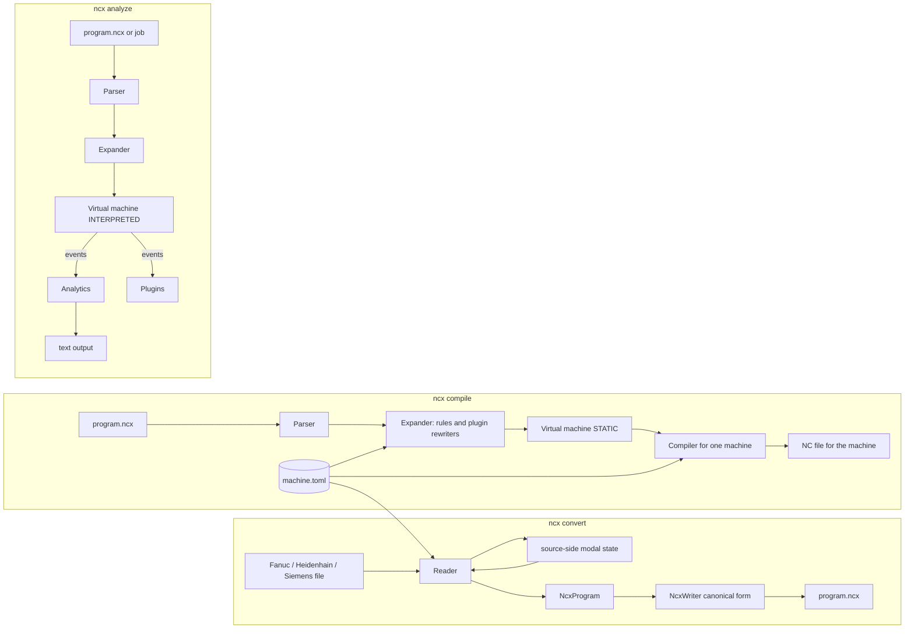

## 2. Guiding rules for the code

1. The virtual machine is the only component that knows what a program means. Readers, compilers and analytics never keep modal state of their own; they ask the VM for the state before and after a block.
2. Everything machine specific is data in the TOML machine configuration. A reader or compiler class exists per controller family (Fanuc, Heidenhain, Siemens), never per machine or builder; builders differ only in templates and tables.
3. NCX text is the only interface between the stages. `convert` produces a file that `compile` reads; nothing is passed around that is not expressible in NCX. This keeps the three uses of the format (conversion, authoring, postprocessor output) on one path.
4. Lossless by default: every diagnostic is collected, nothing is dropped silently, unknown source is kept as `RAW`.
5. Numbers are kept as written (`decimal` plus the original text); formatting happens only in the compiler.
6. String-in, string-out tests at every stage, plus the example files of the specification as acceptance tests.
7. Nothing changes the VM state from outside. Rules and plugins express what they want as NCX blocks that the VM executes (D61, D63); the only mutable hook is the output text of a block.

## 3. Solution layout

```
NCXchange/
  NCXchange.sln
  src/
    Ncx.Core/          model, word catalog, lexer, parser, expressions, expander, virtual machine, events, diagnostics, canonical writer, small geometry, the records of the machine model and the job manifest (D107)
    Ncx.Config/        loading of the machine file (TOML) into the machine model of Core, templates, cycle catalogs, job manifest and vars files, the DefaultMachine (D103, D107)
    Ncx.Readers/       IReader, Fanuc, Heidenhain, Siemens readers, source tokenizers, source-side modal state
    Ncx.Compilers/     ICompiler, Fanuc, Heidenhain, Siemens compilers, number formatting, job compiler
    Ncx.Analytics/     event subscribers that produce text: tool list, runtime, limits, segments, loops, timeline
    Ncx.Plugins/       plugin loader, the concrete RewriteContext built from the D80 settings and the plugin-facing diagnostics helpers; the four interfaces and their signature types live with their callers (IProgramRewriter with RewriteResult and the RewriteContext abstraction, and IVmListener, in Core; ISourceRule in Readers; IBlockWriter in Compilers) (D106)
    Ncx.Cli/           command line application: convert, compile, format, check, analyze, trace, annotate
    Ncx.Kinematics/    later: kinematic tree, tool pose (separate module, never changes NCX)
  tests/
    Ncx.Core.Tests/    parser, expressions, VM state tests (string in, expected state or text out)
    Ncx.Readers.Tests/ source snippet in, NCX text out
    Ncx.Compilers.Tests/ NCX text in, NC text out; round trips over the example files
    Ncx.Acceptance/    the spec examples: 2.5D_FRAESEN from both sources, compile back, diff
  machines/            example machine files (from the spec)
  cycles/              cycle catalogs per controller family
  templates/ncx-plugin/ the plugin template copied by `ncx plugin new` (code-guidelines.md, section 11)
  samples/plugins/     small finished plugins that double as documentation
  docs/                README.md, HANDOFF.md, spec/ (language, VM, configuration, mapping, examples), architecture/ (this outline, code-guidelines.md), controllers/ (knowledge base), decisions/, plan/ (phases, tasks), glossary.md; reading-the-code.md and plugins.md are added by the tasks that write them
```

Dependencies point inward: `Ncx.Core` depends on nothing but the .NET base library; `Ncx.Config` depends on `Ncx.Core` and the TOML parser; readers and compilers depend on both; `Ncx.Plugins` depends on `Ncx.Core`, `Ncx.Readers` and `Ncx.Compilers`, so that a plugin project references `Ncx.Plugins` alone and gets the rest transitively (D106); the CLI depends on everything.

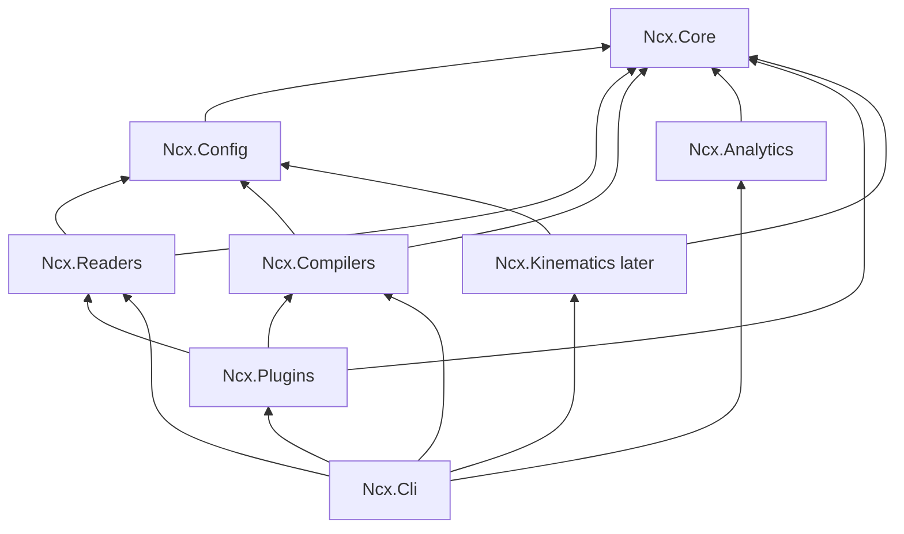

## 4. Core model (Ncx.Core)

The parsed program is a list of blocks, a block a list of words, a word a key with an optional address and an optional typed value, exactly as the lexical rules of the language define it. The word catalog is the schema: it says for every key which value type it takes, whether it is a verb, whether it accepts an address, its scope, and its rank in the canonical order. The parser validates against the catalog so that the VM never sees a wrong value type and no unknown key other than the two provisional forms of 4.1: a machine axis word (D93) and a native parameter of a `CYCLE:<controller>=n` block (D94).

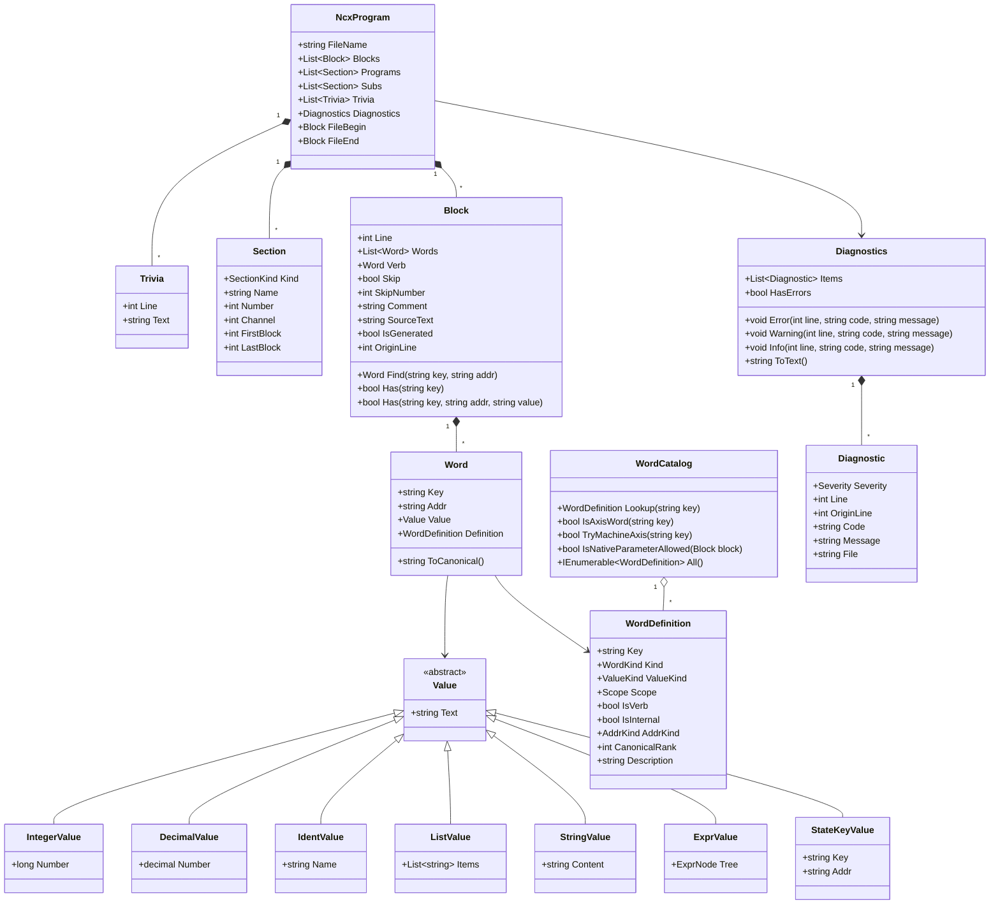

Enumerations: `WordKind` (Program, Frame, Motion, Tool, Spindle, Function, Cycle, Channel, Flow, Lathe, Resource, Pseudo), `ValueKind` (None, Integer, Decimal, Number, Ident, List, String, Expr, NumberOrExpr, StateKey), `Scope` (File, Header, Block, Modal), `AddrKind` (None, Axis, OffsetKind, Channel, Role, Variable, Controller), `Severity` (ERROR, WARNING, INFO, where INFO carries notes that are neither). A diagnostic code is an area prefix and three digits (`PAR`, `VM`, `CFG`, `RDR`, `CMP`, `ANA`, `PLG`, `CLI`), rendered as `file(line): ERROR VM042: message`, with `OriginLine` rendered as `file(line, from 12)` for a diagnostic on a generated block (D98). Comment-only lines and blank lines are not blocks but `Trivia` (line number, text) kept in place; a block keeps its trailing comment text in `Comment` (D92). `StateKeyValue` is the internal value of the pseudo-words `@SAVE` and `@RESTORE`: a state key `KEY[:ADDR]` naming a state variable of the channel, produced only when the parser runs with the option the expander uses for generated text (D95). The catalog entries of `@SAVE` and `@RESTORE` have `WordKind.Pseudo` and `IsInternal = true`; the parser accepts an internal entry only under `ParserOptions.AllowPseudoWords` (D95).

### 4.1 Parsing

The lexer splits a line into the comment and the words, honouring quoted strings and `{...}` expressions; the parser builds words, looks up the catalog, converts values, and applies the block rules (one verb, axis words need a verb, keys unique per block, partner words present). Expressions are parsed into a small AST by a recursive descent parser that follows the grammar of section 4.12 of the language.

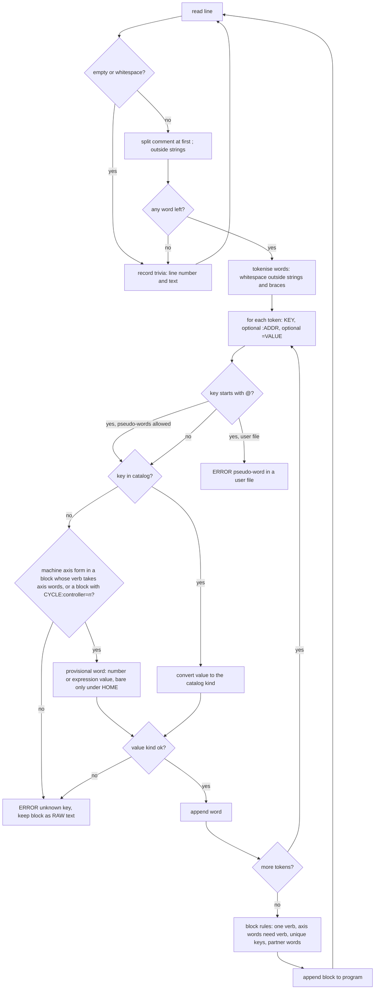

A key the catalog does not know is accepted as a provisional word when it has the form of a machine axis (`[XYZABCUVW][0-9]{0,2}`, or `I` followed by that) in a block whose verb takes axis words, with a number or expression value (bare only under `HOME`), or when it stands in a block with `CYCLE:<controller>=n` as a native cycle parameter; the VM resolves the first against `[[axis]]`, the second stays unresolved (D93, D94). The parser decides the two forms after it has read every token of the block, because the condition is a property of the block, not of the token; in a block with `CYCLE:<controller>=n` an unknown key is a native parameter even when it has the machine-axis form (D94). A key starting with `@` is a pseudo-word (`@SAVE`, `@RESTORE`, section 5.5); the parser accepts it, with a state key `KEY[:ADDR]` as its value, only when it runs with `ParserOptions.AllowPseudoWords`, which the expander sets for generated text; in a user file it is the ERROR "pseudo-word in a user file" (D95).

`NcxWriter` is the inverse: it writes a program in canonical form (word order by `CanonicalRank`, numbers as stored, comments kept; comment-only lines and blank lines are trivia kept in place, the comment column is canonical, D92) and is what `format` and every reader use for output. Generated blocks (section 5.5) are skipped by the writer unless asked for.

### 4.2 Numbers and geometry (D62)

Stored numbers are `decimal` with the original text, so that a program is reproduced digit for digit. Geometry (arc centres from `R`, arc length, the angle between tool vectors, distances) is computed in `double` in a small `Ncx.Core.Geometry` namespace: `Vec3`, `Arc`, `Plane`, an `Angle` helper. That is all levels 0 and 1 of the VM need, so `Ncx.Core` takes no math package. `System.Numerics.Vector3` is single precision and is not used. When the kinematics module needs rotation matrices, frames and an inverse for 5-axis poses, it takes MathNet.Numerics (MIT) in `Ncx.Kinematics` only; nothing of it leaks into the model or the NCX text.

## 5. Virtual machine (Ncx.Core)

The VM executes blocks against a `ChannelState` and raises events. It runs in STATIC mode (one pass over each program, jumps and repeats recorded, every call followed with the caller's state, expressions unresolved; D99) for `convert`, `compile` and `check` (`format` does not run it, D91), and in INTERPRETED mode (flow followed, expressions evaluated, block cap) for `analyze`. The state classes mirror section 2 of the VM specification one to one, so that the specification stays the documentation of the code.

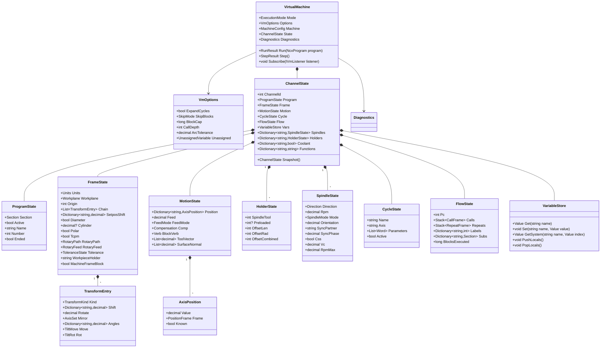

### 5.1 Block execution

One method per step of section 3 of the VM specification; the order is fixed and the state words of a block are applied before its motion.

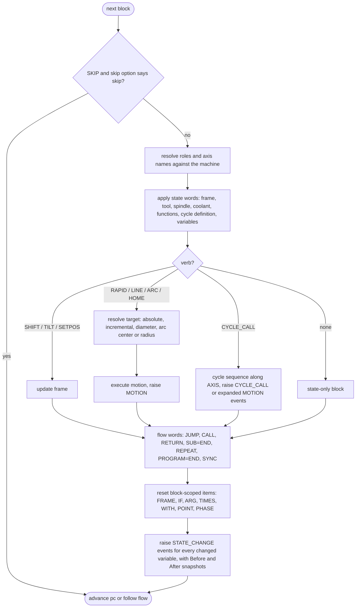

### 5.2 Tool change state per holder

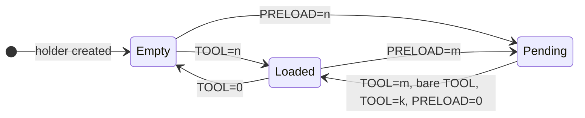

Not drawn: `TOOL=k` in `Loaded` changes the tool without a preload and stays in `Loaded`; `PRELOAD=m2` in `Pending` replaces the pending preload. Leaving `Pending`: `TOOL=m` and the bare `TOOL` change to the preloaded tool and consume the preload; `TOOL=k` with another tool changes too but is a WARNING (the magazine cycles twice); `PRELOAD=0` only drops the preload and returns to the state the spindle was in (`Pending` remembers whether it held a tool, so the return may also be to `Empty`). A bare `TOOL` in `Empty` or `Loaded` is an ERROR (nothing preloaded); `PRELOAD=n` of the tool already in the spindle is a WARNING and changes nothing. Every transition into `Loaded` with a new tool raises `TOOL_END` for the old tool and `TOOL_BEGIN` for the new one.

### 5.3 Events

Every event carries `Before` and `After`, the snapshots of the channel state around the block; they are immutable records, so a listener observes and never mutates (D61, D106). `IVmListener` and the event records are public types of `Ncx.Core`, where the VM that raises them lives (D106). Analytics, plugins and the kinematics module are listeners; the compiler is a listener of `BLOCK_WRITE`, which is the only mutable event.

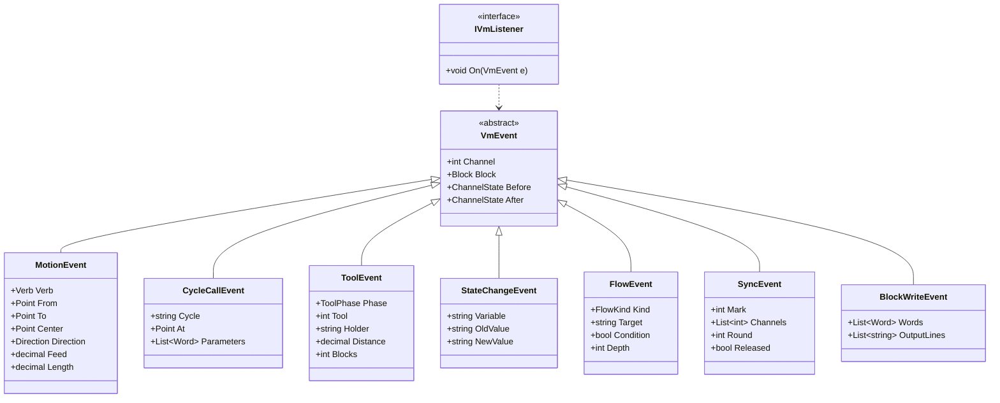

### 5.4 Job scheduler

A job runs one VM per channel program in rounds. `SYNC` marks pair in execution order; a deadlock is reported with the marks and channels involved.

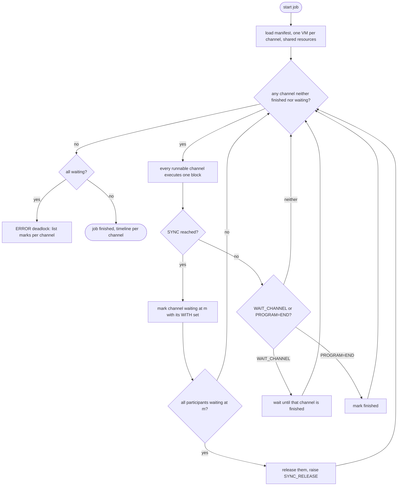

### 5.5 Expander and generated blocks

The expander runs once over the parsed program before the VM. Its inputs are the expansion rules of the machine file (`pre`, `post`, `requires`, `restore` on functions, tool change and cycles) and the plugins that implement `IProgramRewriter`. It never sees VM state; where a rule needs the previous value of something (the spindle that must run again after the coolant clutch has engaged), it emits the pseudo-words `@SAVE=key` and `@RESTORE=key`, and the VM does the remembering from its own snapshot. Generated blocks carry their origin for diagnostics and `trace`, are executed like any block, and are never written by `format`. A `pre` or `post` block may carry `{position:NAME}`; the expander replaces it with the axis words of that entry of the machine's `[positions]` table before the block is parsed, and an unknown name is an ERROR on the rule (machine-config 5a, D100).

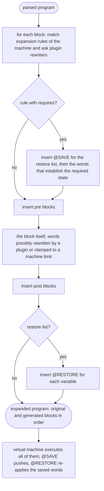

What this gives the shop-floor example: the program says `COOLANT:THROUGH=ON` while the spindle runs at 1500; the rule on that machine says `requires = { SPINDLE = "OFF" }, restore = ["SPINDLE"]`; the expander emits `@SAVE=SPINDLE:MAIN`, `SPINDLE:MAIN=OFF`, the coolant block, `@RESTORE=SPINDLE:MAIN`; the VM turns the restore into `SPINDLE:MAIN=CW RPM:MAIN=1500` and the compiler writes `M5`, `M51`, `M3 S1500`. The runtime estimate charges the stop and the start with the spindle's `accel_time`.

## 6. Machine configuration (Ncx.Config)

The TOML file is loaded into a typed `MachineConfig`. Its records (`MachineConfig` and its tables, and the `JobManifest`) live in `Ncx.Core`, namespace `Ncx.Core.Machine`, so that the virtual machine, the expander and the job scheduler read them without depending on `Ncx.Config`; they keep template values as text, and role, axis and function lookups are methods on them, so that readers, compilers and the VM ask the same object (D107). `Ncx.Config` loads the file into these records and parses each template text once into a `Template` object with named placeholders and format suffixes; a `TemplateSet` per machine serves the readers and compilers (render, match, `FindFunctionByCode`). Function values are strings; the loader accepts a bare integer as `M{n}` and normalizes every M or G code to its spelling without leading zeros (`M08` to `M8`, `G01` to `G1`), the compilers render that form, and `FindFunctionByCode` and `Template.Matches` compare codes by number (D105). The cycle catalog and the job manifest are loaded by the same package. `Ncx.Config` also provides the `DefaultMachine` of D103, the built-in machine that `check`, `analyze`, `trace` and `annotate` use when no `--machine` is given.

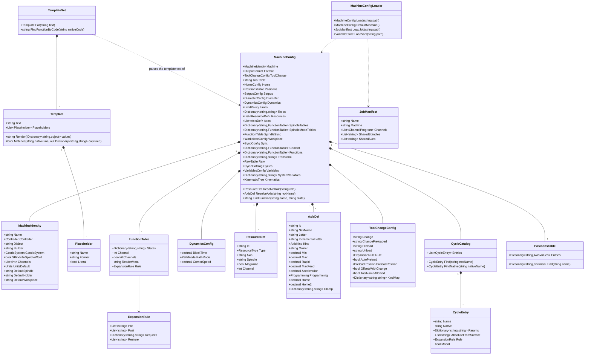

`Template.Matches` is the reader side of a template: the same string that the compiler renders (`"M{mark} P{paths}"`) is turned into a pattern that recognizes the native code and captures its placeholders, so that a machine file describes both directions once.

## 7. Readers (Ncx.Readers)

A reader turns one controller file into an `NcxProgram`. It has three parts: a tokenizer for the controller's syntax (`G01 X10. Z-5.` is not `L X+10 Z-5 F200` is not `G1 X=10 Z=-5`), a source-side modal state that resolves what the controller leaves implicit (active G0/G1/G2/G3, G90/G91, active cycle, preloaded tool, the spindle that owns the last `S`), and the mapping to NCX words through the machine configuration (function tables, templates, cycle catalog). Unknown source becomes `RAW` with a WARNING; what the reader cannot resolve without the machine file (an M code that no table names) becomes `MFUNC`.

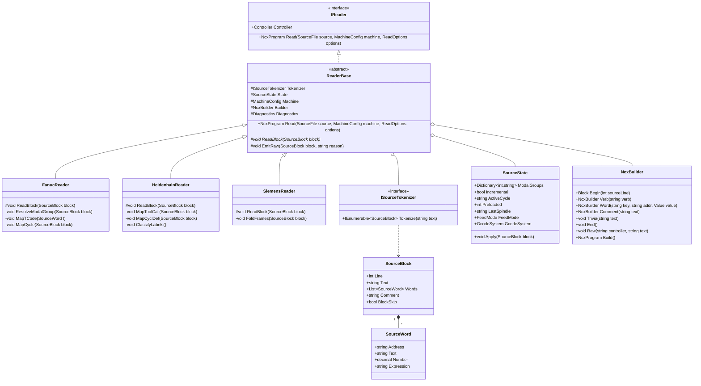

Reading one Fanuc block, as a sequence:

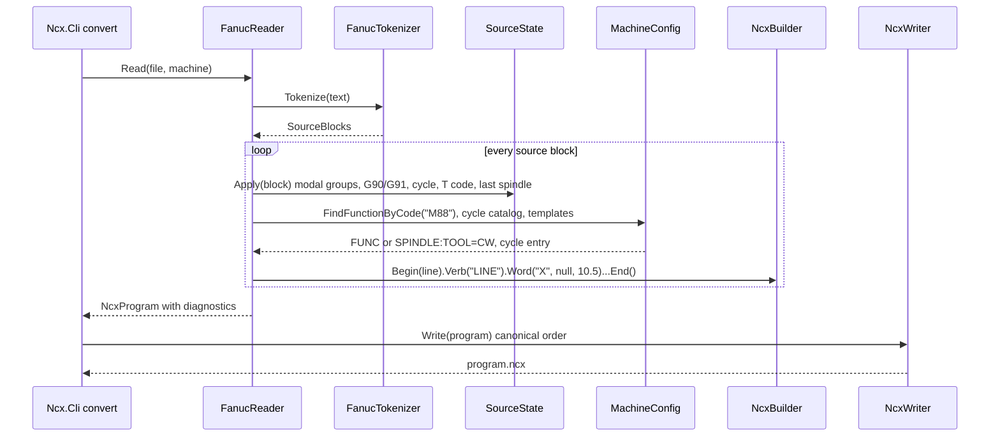

The reader's own `SourceState` is deliberately small: it holds the modal facts the controller keeps implicit. The full meaning is established afterwards by the NCX VM in `check`, which is why `convert` ends with a STATIC pass over the produced program and reports its diagnostics together with the reader's.

## 8. Compilers (Ncx.Compilers)

A compiler runs the VM in STATIC mode over the program and writes one or more output lines per block from the `Before`/`After` state and the templates of the machine. The compiler never decides what a word means; it decides how the machine writes it (`T4 M6` or `TOOL CALL 4 Z S1592`, `M88 S1000` in one block, `G28 U0 W0` for `HOME X Z`). `BLOCK_WRITE` is raised before the lines are written so that plugins can split or edit them.

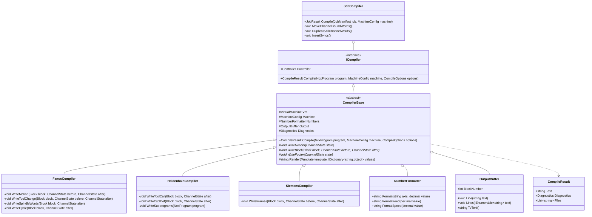

Compiling one block, as a sequence:

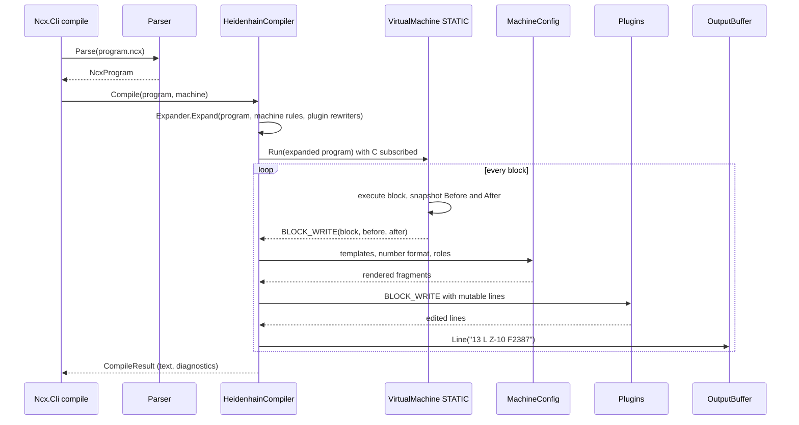

Where the compiler needs look-ahead (`{next}` from a following `PRELOAD`, `{b}` from a following positioning block, the automatic preload of the next tool), it uses the STATIC pre-pass of the VM, which records the tool sequence and the labels before any line is written. The tool kind for `{kind}` comes from the optional tool table (`tool_table` in the machine file, D10); when the table or a tool is missing, the compiler takes the default kind and writes a warning block at the head of the program that names the expected file and the missing tools, so that nobody runs the program by accident.

## 9. Analytics and plugins

Analytics are listeners. Each one is a class that subscribes to the events it needs and writes a text table at the end; they never touch the VM state directly.

| Analytic | Events | Output |
|---|---|---|
| Tool list | TOOL_BEGIN, TOOL_END, PRELOAD | one row per tool use: rpm, feeds, offsets, distance, blocks, preload behaviour |
| Runtime estimate | MOTION, CYCLE_CALL, STATE_CHANGE (dwell, spindle), SYNC | trapezoidal profile per block from `max_feed`, `acceleration`, `rapid` of the moving axes, the control's `block_time` and `path_mode`, spindle `accel_time` for starts and stops (D64); per tool, section, channel; job time as the longest channel with waits |
| Travel limits | MOTION | min and max per axis in the MACHINE frame against the `limits` of `[[axis]]` (machine coordinates, D100), offending blocks; positions known only in the workpiece frame are not checked |
| Datum, feed, speed lists | STATE_CHANGE | one row per change |
| Segment length and tool vector change | MOTION | distance between consecutive end points and the angle between consecutive tool vectors per motion, the two analytics CAM programmers use to judge 5-axis output |
| Loop statistics | FLOW (INTERPRETED) | blocks per label section, iteration counts, final variables |
| Channel timeline | SYNC, MOTION | estimated time per block aligned at marks, waiting time per channel |
| Trace, annotate | STATE_CHANGE | history outputs of the VM specification section 6 |

Plugins are user DLLs found through `ncx.toml`, each loaded into its own `AssemblyLoadContext`, which shares every `Ncx.*` assembly with the host, so that types are identical, and isolates everything else the plugin brings (D106). A plugin project references `Ncx.Plugins` alone (the loader, the concrete context built from the D80 settings, the diagnostics helpers) and gets the four interfaces and their signature types (`RewriteResult`, the `RewriteContext` abstraction) transitively from their callers: `IProgramRewriter` and `IVmListener` in `Ncx.Core`, `ISourceRule` in `Ncx.Readers`, `IBlockWriter` in `Ncx.Compilers` (D106). None of them mutates the VM state; listeners receive read-only snapshots (D61, D106):

| Interface | When | May do |
|---|---|---|
| `ISourceRule` | in a reader, per source block, with the source-side state | decide what a machine-specific M code or sequence of source blocks means on this machine and emit the NCX words for it (the workpiece transfer behind a builder M code with a hidden subprogram, `M5` `M51` `M3 S1500` folded back into `COOLANT:THROUGH=ON`); the configuration tables are tried first (D40, D66) |
| `IProgramRewriter` | in the expander, before the VM | rewrite the words of a block, insert generated blocks before or after it (clamp `RPM` to a limit, add `HOME Z` before `TOOL`, stop the spindle before a function and `@RESTORE` it after) |
| `IVmListener` | on every VM event, with `Before` and `After` | observe; the hook names of the initial thoughts (`tool_begin`) are the event kinds |
| `IBlockWriter` | on `BLOCK_WRITE` in the compiler | edit the output lines (`Z` on its own line, strip umlauts from a comment) |

A rewriter that changes a speed does not set `spindle.rpm`; it changes the `RPM` word, the VM executes the changed block, and `trace` shows the original and the changed value with the plugin's name. Machine limits (`rpm_max`, `max_feed`, travel limits) are configuration and are applied by the expander itself per the `limits` policy; a plugin is for logic the configuration cannot express.

The API is shaped for NC programmers with little C# (code-guidelines.md, sections 10 and 11): one method per interface, `Block.Has(key)`, `Block.Has(key, addr, value)` and `Block.Find(...)` as the lookups (D106), `RewriteResult.Unchanged`, `Replace(...)`, `Surround(before, after, reason)` as the answers, inserted blocks given as NCX text that the expander parses, and a `RewriteContext` with machine name, channel, line and the plugin's own settings dictionary (D80) but no VM. The template project in `templates/ncx-plugin` is the entry point; `ncx plugin new` copies it.

## 10. Command line (Ncx.Cli)

| Command | Input | Pipeline | Output |
|---|---|---|---|
| `ncx convert <file> --machine <toml>` | controller file | reader, NcxWriter, STATIC check | `.ncx` in the working directory, diagnostics |
| `ncx compile <file.ncx> --machine <toml>` | NCX | parser, VM STATIC, compiler | NC file under `out/<machine>/`, diagnostics |
| `ncx compile --job <job.toml>` | job manifest | parser per channel, job compiler | one NC file per channel |
| `ncx format <file.ncx> [--check]` | NCX | parser, NcxWriter | canonical text to stdout or `--output`; with `--check` no output, exit 1 on a difference |
| `ncx check <file.ncx> [--machine <toml>]` | NCX | parser, VM STATIC | diagnostics only |
| `ncx analyze <file.ncx or job> [--machine <toml>] [--vars file] [--from n --to m]` | NCX | parser, VM INTERPRETED, analytics over the block range | text tables |
| `ncx trace`, `ncx annotate` `[--machine <toml>]` | NCX | parser, VM | history outputs |
| `ncx plugin new <name>`, `build`, `check`, `test` | template | copies the plugin template, builds it into `plugins/`, registers it in `ncx.toml`, loads and lists a DLL's interfaces | a runnable plugin without knowing `dotnet new` |

Every command accepts `--strict`, under which a WARNING sets the exit code 1 (D97).

`ncx.toml` in the working directory names the machine file that `--machine` defaults to, the machine and cycle folders, the output folder and the plugin assemblies. Without `--machine` and without a machine named in `ncx.toml`, `check`, `analyze`, `trace` and `annotate` run against the built-in default machine of D103; `compile` and `convert` keep requiring a machine file from one of the two (D77, D103). Exit code 0 when the run produced no ERROR; 1 on at least one ERROR, on a WARNING under `--strict`, or when `format --check` finds a difference; 2 for a usage error, an unreadable input or a missing machine file where one is required (D97). Code 2 is decided before the run starts and takes precedence; a run that has started ends with 0 or 1.

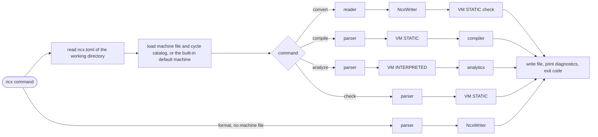

## 11. Testing

- Unit tests per project, string in and expected text or state out, one test per NC feature.
- Reader tests: a source snippet (`G81 G99 Z-21.732 R5. F565` then `X30.`) and the expected NCX lines.
- Compiler tests: NCX lines and the expected controller lines, per machine file.
- VM tests: a program and the expected state after a given block, plus expected diagnostics (the validation list of the VM specification is the checklist).
- Acceptance: the example files of the specification. `2.5D_FRAESEN.ncx` must be produced from both of its source programs, which are kept next to it (`convert` from the Fanuc and from the Heidenhain file gives the same canonical text), and compiled back to both controllers without loss; the five example machine files must load (D104); every `.ncx` example must pass `check`.
- The sample corpus (customer and manual programs for the three controller families, kept outside the repository by the maintainer; described in `../spec/controller-mapping.md`, section 11) is the growing test bed for reader robustness: `convert` must at least never crash and must report every unread block as RAW.

## 12. Build order

Each milestone ends with tests and a runnable `ncx` command, so that the project can be shown at any point.

| Milestone | Content | Done when |
|---|---|---|
| M1 Parser and canonical writer | word catalog, lexer, parser, expressions, `NcxWriter`, `ncx format` | the five spec examples parse and format to themselves |
| M2 Virtual machine STATIC | state classes, block execution, validation, events, expander with `@SAVE`/`@RESTORE`, `ncx check` | the five examples check with no ERROR without a machine file (D103, against the `DefaultMachine` of `Ncx.Config`, whose loader and templates are built before this milestone); the validation list has a test each; the coolant clutch rule expands and restores |
| M3 Machine configuration | roles, cycle catalog, five example machines (with `millturn1.toml`, D104); the TOML loader with `DefaultMachine` and the templates both ways (P2-01, P2-02) are built before M2, see `../plan/phases.md` | machine files load; templates render and match; the five examples check with no ERROR with their machine files (D103, D104) |
| M4 Fanuc reader | tokenizer, source state, mapping, `ncx convert` | 2.5D_FRAESEN from the Fanuc sample equals the spec example |
| M5 Heidenhain compiler | `ncx compile` for the iTNC 530 | the example compiles to a program equivalent to the Heidenhain sample |
| M6 Heidenhain reader and Fanuc compiler | the other direction | round trip without loss on 2.5D_FRAESEN, BOHREN, 3D Fraesen |
| M7 VM INTERPRETED and analytics | expressions, flow, block cap, the analytics of section 9, `ncx analyze` | segment length and tool vector change run on the 5-axis sample programs and their results are recorded as the reference for later versions |
| M8 Siemens reader and compiler | generic Sinumerik 840D sl per the programming manual (frames with `TRANS`/`ATRANS` semantics, `T=`/`M6`/`D`, `SETMS` and `S<n>=`, `MCALL` cycles with the 840D sl signatures, `PROC`/`RET`, `WAITM`); GILDEMEISTER structure programming stays documentation only (D68); the builder posts of the corpus (Monforts, STAMA, INDEX) run through `RAW:BUILDER` and reader rules | MILLTURN_TRANSFER compiles for a plain 840D machine file; the Hermle C22 U and a Burkhardt+Weber program of the corpus read without loss |
| M9 Jobs and channels | scheduler, job manifest, job compiler with channel binding | the two Nakamura WY250L programs (`../spec/examples/sources/NAKAMURA_WY250L_O1000.path1.nc` and `.path2.nc`) read as a job and analyze without deadlock |
| M10 Plugins | `Ncx.Plugins` (the loader, the concrete `RewriteContext`, the diagnostics helpers; the four interfaces exist in Core, Readers and Compilers since M2 and M5, D106), assembly loading in a context that shares the `Ncx.*` assemblies, the plugin template and `ncx plugin new`, `docs/plugins.md` | the template builds and runs unchanged; the coolant clutch sample expands and restores; a sample plugin puts Z on its own line |
| later | kinematics module, further controllers (Mazak, Okuma from the samples), a GUI or web front end | |

## 13. Open points that touch the architecture

- D10 tool table (settled): optional `tools.toml`; missing data becomes a warning block at the head of the compiled program.
- D16 history: `trace` and `annotate` are analytics, no history in the model.
- D52: look-ahead in the compiler is done on the STATIC pre-pass; nothing in the model.
- D56 channel-bound functions: only the job compiler knows several channels; the single-file compiler reports the ERROR.
- D57 sub spindle frame: the conversion between the holder frame and the machine's convention lives in readers and compilers, never in the VM.
- D65 (settled, with D90): `G70`..`G76` contours are `SUB` sections named by `CONTOUR=name` on the cycle block (language 4.7, 4.7.1); the Fanuc `P`/`Q` block range maps to that section, and `CycleEntry` gets a `Contour` field in P2-03.
- D60 diameter: the reader needs the X axis `programming` of the source machine, which means `convert` always needs a machine file (a plain controller family is not enough for a lathe).
- D62 math (settled): no package in `Ncx.Core`; MathNet.Numerics only in `Ncx.Kinematics`.
- D31 (settled): `FrameState` holds an ordered transform chain (`TransformEntry` list), not one slot per kind; the class diagram shows the chain since draft 4.
- D48 (settled 2026-09-12): a file holds programs and subprograms as `Section`s of one `NcxProgram`; the parser's pre-pass fills them, the VM runs one program per channel and enters subprograms by `CALL`; there is no `EXIT`, `PROGRAM=END` ends the program and `JUMP=END` reaches it. The job manifest may name the program inside a file; the compiler's `program_layout` decides whether the sections go into one output file or one file each (Heidenhain).
- D81 to D86 (settled 2026-09-12): vector motion (`ToolVector`, `SurfaceNormal` in `MotionState`), `TILT_AXIS` as a `TransformEntry` kind with the `MOVE` and `ROT` options, the `RETRACT` verb, `ANGLE` arcs (the arc resolver gets a sweep form), `TOLERANCE`, `ROTARY_PATH` and `ROTARY_FEED` as state; words and VM state only, no new component. The vector words are the first place where the kinematics module would change what the VM knows (the rotary positions), which is why the VM stores them unresolved.
- D66 (settled): folding an expanded sequence back into one word is a reader rule (`ISourceRule` from a plugin, or the configuration tables); no generic multi-block matcher in the core.
- D64 dynamics: the runtime estimate stays an estimate; the control's look-ahead is not modelled beyond `path_mode` and `corner_speed`.
- D91 (settled 2026-09-11): `format` is parser and `NcxWriter` only, takes no machine file and does not run the VM; `check` is the command that resolves.
- D92 (settled 2026-09-11): comment-only lines and blank lines are `Trivia` on `NcxProgram`, a block keeps its comment in `Block.Comment`; the writer keeps them in place and normalizes only the comment column.
- D93 (settled 2026-09-11): the parser accepts a machine-axis-shaped key it does not know as a provisional word and the VM resolves it against `[[axis]]`; native cycle parameters (D94) are provisional the same way and stay unresolved.
- D95 (settled 2026-09-11): the pseudo-words `@SAVE` and `@RESTORE` carry a `StateKeyValue` (`KEY[:ADDR]`, a state variable of the channel) and are parsed only under `ParserOptions.AllowPseudoWords`, which the expander sets for generated text; in a user file they are the ERROR "pseudo-word in a user file".
- D97 (settled 2026-09-11): one exit code table for every command (0, 1, 2 as in section 10).
- D98 (settled 2026-09-11): diagnostic codes are an area prefix and three digits, severities ERROR, WARNING, INFO, `Diagnostic.OriginLine` for generated blocks.
- D99 (settled 2026-09-11): STATIC mode follows calls with the caller's state; an uncalled subprogram is walked once from a default entry state with the caller-dependent validations suppressed; the compilers still emit each `SUB` section once, not once per `CALL`; under `program_layout = "file_per_program"` (Heidenhain) that is once per calling program (VM 3.9, language 4.13). Clarified 2026-09-13: `TIMES=n` is walked n times, external calls are not followed, the call depth applies, and each `SUB` is written from an unknown target state.
- D103 (settled 2026-09-11): `Ncx.Config` carries a built-in `DefaultMachine`; `check`, `analyze`, `trace` and `annotate` run against it without `--machine`; a work spindle created on the spot gets its own rotary axis (clarified 2026-09-13).
- D105 (settled 2026-09-11): function values are normalized strings; `FindFunctionByCode` and `Template.Matches` compare M and G codes by number.
- D106 (settled 2026-09-11): the plugin interfaces live with their callers (Core, Readers, Compilers); `Ncx.Plugins` holds the loader and the plugin-facing helpers and depends on Core, Readers and Compilers; the `AssemblyLoadContext` shares the `Ncx.*` assemblies with the host.
- D107 (settled 2026-09-13): the records of the machine model and the job manifest live in `Ncx.Core`, `Ncx.Config` loads them and parses the template text; this removes the cycle Core to Config that the VM holding a `MachineConfig` would otherwise create.
