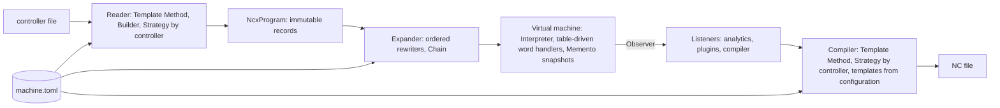

# NCXchange Code Guidelines

Status: Version 1.0, 2026-09-12 (draft 2 in the drafting history of `../decisions/decisions.md`). How the code of NCXchange is written: the principles, the comment rule, the C# conventions we follow, the design patterns we use and the ones we leave out, error handling, types, tests, repository settings. Companion to `architecture.md`. Where this document and the architecture disagree, this document wins for style and the architecture for structure.

## 1. Four rules above everything

1. **Comments are not there to explain the code to the human. The code is there to explain the comment to the computer.** A comment states what must be true in the words of the specification; the code beneath it is the proof. Written in that order: comment first, then the code that fulfils it. If the code cannot be read as the implementation of its comment, one of the two is wrong.
2. **Common C# conventions**, as published by Microsoft for the .NET runtime, the compiler and the docs (`learn.microsoft.com/dotnet/csharp/fundamentals/coding-style/coding-conventions` and `.../identifier-names`). Section 3 lists what we adopt and the few places where the page leaves a choice and we make one.
3. **SOLID with KISS.** Every SOLID principle is applied where it removes a reason to change; none is applied for its own sake. The simplest structure that satisfies the specification wins, and an abstraction is introduced on its second use, not its first.
4. **The next person in this code may not be a programmer.** An NC programmer who adapts a reader to his machine, writes a plugin for his shop or fixes a template must be able to do so with the C# he can pick up in a week. Every construct is chosen for that reader, and the extension points come with a template and a worked example (section 11).

## 2. Comments

The specification is the design; the code implements it sentence by sentence. Comments therefore quote or point to the sentence they implement, and the reader of the code can open the specification at the cited section and find the same rule.

Rules:

- Every non-trivial method or block of logic begins with a comment that says what is being established, in the language of the specification, with the section in brackets: `// A different tool preloaded than called is a WARNING, the magazine cycles twice (virtual machine 3.5).`
- A comment describes intent and rule, never mechanics. `// Increment i` is forbidden; `// Consume the preload only when it names the tool that arrives` is the point.
- Where a comment would narrate what the code obviously does, the code needs a better name instead of a comment.
- Public types and members of `Ncx.Core`, `Ncx.Config`, `Ncx.Readers`, `Ncx.Compilers` and `Ncx.Plugins` carry XML documentation comments (`/// <summary>`), because plugins and future front ends are written against them (the four plugin interfaces live in Core, Readers and Compilers, D106). Internal members carry XML comments only when the summary says something the name does not.
- Microsoft's comment style applies: `//` single-line comments on their own line above the code, one space after the delimiter, first letter uppercase, a full stop at the end; no `/* */` blocks; no comments at the end of a code line except for a table-like sequence of constants.
- Open work is written as `// TODO(Dnn): ...` when it waits on a decision of the log, or `// TODO: ...` with a sentence that says what is missing, never a bare `// TODO`.
- No commented-out code. Git remembers.
- Diagnostics text follows the same rule: a message names the rule and the block, not the internal state (`Tool 5 was preloaded but tool 4 is called (virtual machine 3.5).`).

An example of the comment-first style, taken from the tool change rules of the virtual machine (3.5):

```csharp
namespace Ncx.Core.VirtualMachine;

/// <summary>
/// Applies the two-word tool change (language 4.4) to a holder (virtual machine 3.5).
/// </summary>
internal static class ToolChangeRules
{
    // TOOL=n puts n into the spindle. The preload is consumed only when it names the
    // tool that arrives; a different preload is a WARNING because the magazine has to
    // cycle twice (virtual machine 3.5, row TOOL=n).
    public static void ApplyTool(HolderState holder, ToolRef tool, Block block, Diagnostics diagnostics)
    {
        if (holder.Preloaded is ToolRef preloaded && preloaded != tool)
        {
            diagnostics.Warning(block.Line, DiagnosticCodes.PreloadMismatch,
                $"Tool {preloaded} was preloaded but tool {tool} is called (virtual machine 3.5).");
        }

        // The change itself: TOOL_END for the old tool, TOOL_BEGIN for the new one, is
        // raised by the caller from the Before and After snapshots.
        holder.SpindleTool = tool;
        holder.Preloaded = holder.Preloaded == tool ? null : holder.Preloaded;
    }

    // A bare TOOL changes to the preloaded tool and is an ERROR when nothing is
    // preloaded (virtual machine 3.5, row TOOL).
    public static void ApplyBareTool(HolderState holder, Block block, Diagnostics diagnostics)
    {
        if (holder.Preloaded is not ToolRef preloaded)
        {
            diagnostics.Error(block.Line, DiagnosticCodes.NothingPreloaded,
                "TOOL without a value needs a preloaded tool (virtual machine 3.5).");
            return;
        }

        holder.SpindleTool = preloaded;
        holder.Preloaded = null;
    }
}
```

## 3. C# conventions

We follow the Microsoft conventions as written. The list below is what a reviewer checks; the wording follows the source pages.

### 3.1 Naming (identifier-names page)

- PascalCase for type names, namespaces and all public members (fields, properties, events, methods, local functions). Interfaces are PascalCase with an `I` prefix. Attribute types end with `Attribute`. Enums use a singular noun for non-flags and a plural noun for flags.
- camelCase with an `_` prefix for private or internal non-constant fields; `s_` for private or internal static fields; `t_` for thread static fields.
- camelCase for local variables, parameters and delegate instances; PascalCase for constants of every visibility, fields and locals alike.
- Positional record parameters are PascalCase (they become properties); primary constructor parameters of classes and structs are camelCase.
- Generic type parameters are descriptive with a `T` prefix (`TState`), or plain `T` when there is one and a name adds nothing.
- Meaningful, descriptive names; clarity over brevity; no abbreviations except widely known ones (`Rpm`, `Ncx`, `Toml`, `Cli` count as known here); no single-letter names except loop counters; never two consecutive underscores.
- Domain names come from the specification: `HolderState`, `Preloaded`, `SpindleTool`, `Workplane`, `CanonicalRank`. When the specification names a thing, the code uses that name.

### 3.2 Language guidelines (coding-conventions page)

- Modern language features whenever possible; no outdated constructs.
- Language keywords for types (`string`, `int`, `decimal`), not the runtime type names; `int` rather than unsigned types.
- `var` only when the type is obvious from the right-hand side; not because a method name suggests it; explicit types in `foreach`; `var` in `for` counters and for LINQ query results.
- String interpolation for short strings, `StringBuilder` in loops, raw string literals (`"""`) instead of escape sequences, which matters for the string-in string-out tests full of NC code.
- `required` properties instead of constructors to force initialization; object initializers; the concise `new()` forms; collection expressions (`[ "a", "b" ]`).
- `Func<>` and `Action<>` instead of own delegate types.
- `using` declarations without braces; `try-catch` for exception handling, and only exceptions that can be handled; specific exception types; never a bare `catch (Exception)` without a filter.
- `&&` and `||` for comparisons; static members called through the class name; LINQ with meaningful query variable names and `where` before the other clauses, within the limits of section 10.2 (short method chains, no query syntax) in the parts an NC programmer touches.
- File-scoped namespace declarations; `using` directives outside the namespace.

### 3.3 Layout

- Four spaces, no tabs; Allman braces (opening and closing brace on their own line); one statement and one declaration per line; continuation lines indented one level; a blank line between members; parentheses that make clauses apparent; line breaks before binary operators.
- Line length: the Microsoft page limits doc samples to 65 characters for mobile screens; this project uses 120 and lets the formatter enforce it.
- One type per file, file name equals type name, folder path equals namespace (`src/Ncx.Core/VirtualMachine/ToolChangeRules.cs` is `Ncx.Core.VirtualMachine.ToolChangeRules`).
- Member order inside a type: constants and static fields, instance fields, constructors, properties, public methods, private methods.

### 3.4 Where the page leaves a choice, we choose

- `async`: the Microsoft page recommends `async`/`await` for I/O-bound work. NCXchange is a batch command that reads one file and writes one file; the code is synchronous by decision, and a server front end that wants asynchrony wraps it later (KISS).
- Nullable reference types are enabled everywhere and warnings are errors; `?` on a type is a statement that null is a valid value, and every such value is handled at the point of use, not by a null check three calls later.
- Number parsing and formatting always pass `CultureInfo.InvariantCulture`. An implementation that parses with the OS culture reads `X10.5` as ten thousand five hundred on a German-Swiss machine (this has happened); the analyzer rule CA1305 is an error in this repository.
- `sealed` by default on classes that are not designed for inheritance; `internal` by default with `InternalsVisibleTo` for the test projects; `public` only for what plugins and front ends need.
- `record` for immutable data (blocks, words, values, options, events), `class` for state that changes (`ChannelState` and its parts), `readonly record struct` for small values such as `Vec3`.
- Pattern matching (`switch` expressions, `is` patterns) is the way to dispatch on value types and events; no Visitor classes.

## 4. SOLID, applied here

| Principle | What it means in NCXchange | Where it shows |
|---|---|---|
| Single responsibility | A class has one reason to change. The parser changes when the lexical rules change, the VM when a rule of the state model changes, a reader when a controller's syntax changes, a compiler when a controller's output form changes, the configuration loader when the TOML schema changes. | `Parser`, `VirtualMachine`, `FanucReader`, `HeidenhainCompiler`, `MachineConfigLoader` |
| Open/closed | New behaviour arrives as new entries and new classes, not as edits: a new NCX word is a catalog entry plus a handler, a new controller family is a reader and a compiler registered by name, a new analytic is a listener, a new machine is a TOML file, a new rule of a machine is an expansion rule. The VM does not change for any of them. | `WordCatalog`, `ReaderRegistry`, `CompilerRegistry`, `IVmListener`, `MachineConfig` |
| Liskov substitution | Every `IReader` keeps the same contract: it never throws on bad input, it reports everything through `Diagnostics`, it produces a program that `check` can run, it keeps what it cannot express as `RAW`. A shared contract test suite runs against every reader and every compiler. | `ReaderContractTests`, `CompilerContractTests` |
| Interface segregation | Small interfaces with one purpose: `ISourceRule.Read(...)`, `IVmListener.On(VmEvent)`, `IProgramRewriter.Rewrite(...)`, `IBlockWriter.Write(...)`, `ISourceTokenizer.Tokenize(...)`. A plugin implements only what it needs. | `Ncx.Core`, `Ncx.Readers`, `Ncx.Compilers`, where the interfaces live (D106) |
| Dependency inversion | An interface lives with its caller: `IVmListener` and `IProgramRewriter` in `Ncx.Core`, `ISourceRule` and `IReader` in `Ncx.Readers`, `IBlockWriter` and `ICompiler` in `Ncx.Compilers`; the outer projects implement them; `Ncx.Cli` composes everything in one place (D106). Nothing in Core knows a controller, a file format or the command line. | `Program.cs` as the composition root |

KISS is the counterweight, and it decides the ties:

- A table beats a class hierarchy. The word catalog is a table, the tool change is a state table, the builder dialects are TOML tables, not subclasses.
- A record beats a builder, except where building is incremental across many calls (`NcxBuilder` in readers is the one builder).
- One level of inheritance at most: an abstract base with the template method and concrete subclasses; no grandchildren.
- A method may be long when it mirrors a numbered list of the specification; splitting it to satisfy a line count hides the list.
- No abstraction on first use. Two readers share a base class because there are three of them; a fourth controller may earn a helper, not a framework.
- No dependency for something the base library does: JSON, XML, LINQ, `System.CommandLine` for the CLI and Tomlyn for TOML are the packages; nothing else without a decision in the log.

## 5. Patterns we use, and why



| Pattern | Used for | Why this and not something else |
|---|---|---|
| Pipeline | The whole tool: reader, canonical writer, parser, expander, VM, compiler, analytics are stages that hand each other a `NcxProgram` or NCX text. | Every stage is testable alone with text in and text out, and the NCX file between stages is the product itself. |
| Strategy | One reader and one compiler per controller family, chosen by the `controller` of the machine file through a registry (a dictionary from name to factory). | A `switch` on the controller inside the VM or the CLI would grow with every family; a registry entry does not. |
| Template Method | `ReaderBase.Read` and `CompilerBase.Compile` fix the skeleton (tokenize, loop, source state, diagnostics, canonical output) and call the abstract per-block methods. | The skeleton is identical for all three controllers; only the block mapping differs. |
| Builder | `NcxBuilder` assembles blocks word by word while a reader walks a source block. | A reader discovers the words of a block in source order and wants them written in canonical order; the builder sorts at `End()`. |
| Interpreter | The expression evaluator over the `ExprNode` tree, and the VM itself as the interpreter of NCX blocks. | The grammar of section 4.12 of the language maps one to one onto node types; a recursive `Evaluate` is the shortest correct code. |
| Table-driven dispatch | The `WordCatalog` holds, per key, the definition and the handler that applies the word to a `ChannelState`; the tool change is a transition table; builder codes are TOML tables. | A giant `switch` over sixty keys is the alternative; a table is open for extension and readable as the specification's catalog. |
| Observer | The VM raises `VmEvent`s to `IVmListener`s: analytics, plugins, the compiler on `BLOCK_WRITE`. | Analytics and plugins never touch the state and can be added without changing the VM. |
| Memento | `ChannelState.Snapshot()` gives `Before` and `After` to every event; `@SAVE` and `@RESTORE` push and pop snapshots of named variables. | The specification demands history without storing it in the program; a snapshot is the cheapest faithful history. |
| Chain of rewriters | The expander runs the expansion rules of the machine and the plugin rewriters in a fixed order over each block. | Rules compose (a tool change may retract and clamp); an ordered list is enough, no priorities or events between rules. |
| Registry | Readers, compilers, analytics and word handlers register by name at start-up. | Discovery by reflection is invisible; a registration line is greppable. |
| Options | `ReadOptions`, `CompileOptions`, `VmOptions` are records passed explicitly. | No global settings, no static state; a test constructs the options it needs. |
| Diagnostics as a result | Every stage collects `Diagnostic` records with severity, file, line, code, message and, for generated blocks, the originating line (D98); the run stops on ERROR. | The user reads a list; exceptions are for programmer errors and I/O (section 6). |
| Composition root | `Program.cs` builds the object graph by hand with constructor injection. | No container: a dozen objects wired in one readable method, and the wiring is the documentation of the dependencies. |
| Plugin isolation | Plugin assemblies load into their own `AssemblyLoadContext`; the context shares every `Ncx.*` assembly with the host, so types are identical, and isolates everything else the plugin brings (D106). | A plugin cannot reach into the VM even by accident (D61). |
| Template project | `templates/ncx-plugin`, copied by `ncx plugin new`, with a working example and one test. | A plugin author starts from something that runs, not from an empty file (section 11). |

Patterns we do not use, on purpose:

- Visitor: C# pattern matching covers the value and event hierarchies without double dispatch.
- Abstract Factory and Service Locator: the registries are dictionaries, the composition root is a method.
- Dependency injection container, MediatR-style buses, AutoMapper: more machinery than the problem.
- Singleton: there is no global state; the machine configuration is passed where it is needed.
- Deep inheritance and mixins: one base class per family, composition otherwise.
- Async: see 3.4.
- Exceptions for control flow: see section 6.

## 6. Errors and diagnostics

- Anything the user can cause (a wrong word, an unknown role, an arc that does not close, a missing machine file) is a `Diagnostic`, never an exception. The stage records it and continues where the specification allows (WARNING) or stops the run (ERROR); the CLI prints the list and sets the exit code (0, 1, 2 per D97).
- Exceptions are for programmer errors (`InvalidOperationException` when a handler is called with a word its catalog entry excludes) and for I/O and environment (`IOException`, `FileNotFoundException`), caught only at the composition root and reported as a diagnostic with the file name.
- Diagnostic codes are constants in one class per project (`DiagnosticCodes.PreloadMismatch = "VM042"`), stable across versions so that tests can assert on them and users can search for them. A code is an area prefix and three digits: `PAR` (lexer, parser, catalog), `VM`, `CFG`, `RDR`, `CMP`, `ANA`, `PLG`, `CLI`; a diagnostic is rendered as `file(line): ERROR VM042: message`; the severities are ERROR, WARNING and INFO, where INFO carries notes that are neither (`plugin MyShopRules: inserted 2 blocks at line 12`) (D98).
- Every diagnostic carries the line of the NCX block or source block and, for generated blocks, the line of the originating block (`OriginLine`, D98).
- No `catch (Exception)` without a filter; no swallowing; no logging framework in 1.0 (the diagnostics list is the log).

## 7. Types and data

- The program model (`NcxProgram`, `Block`, `Word`, `Value` and its subclasses, `ExprNode`) is immutable: positional records, init-only properties, `IReadOnlyList<T>`. A stage that changes a program builds a new one (the expander returns a new `NcxProgram`).
- The VM state (`ChannelState`, `FrameState`, `MotionState`, `HolderState`, `SpindleState`, `CycleState`, `FlowState`) is mutable by design and only the VM mutates it; `Snapshot()` returns a deep copy that is immutable to its holder.
- Configuration (`MachineConfig` and its parts) is loaded once and never changed; `Template` parses its placeholders in the constructor.
- Numbers: `decimal` with the original text in `DecimalValue`; `double` only inside geometry; `int` for tool numbers, offsets, marks, lines; never `float`.
- Enumerations for closed sets of the specification (`Verb`, `Units`, `Workplane`, `FeedMode`, `SpindleMode`, `Severity`); strings for open sets (roles, axis names, function names, cycle names).
- No `dynamic`, no `object` in public signatures, no tuples in public signatures (a record with names instead).

## 8. Tests

- xUnit, no mocking framework; test doubles are small hand-written fakes (`FakeListener` that records events). Assertions with xUnit `Assert`; a failing string comparison prints both texts.
- Naming: `MethodOrRule_Scenario_Expectation`, for example `ApplyTool_DifferentToolPreloaded_WarnsPreloadMismatch`.
- String in, string out: readers and compilers are tested with raw string literals of NC code and NCX; the expected text is the exact canonical output. VM tests assert on the state after a block and on the diagnostics list.
- One test per rule of the specification's validation list (virtual machine 5) and per row of the tool change table (3.5); the test name cites the rule.
- Contract test suites run the same cases against every reader and every compiler.
- Acceptance tests are the example files of the specification with their source programs, and the sample corpus, compared as whole files; a difference is shown as a diff.
- Tests are fast, deterministic and independent of the working directory; they read fixtures embedded in the test assembly.

## 9. Repository settings

- `Directory.Build.props` at the root: `<TargetFramework>` the current LTS, `<Nullable>enable</Nullable>`, `<ImplicitUsings>enable</ImplicitUsings>`, `<TreatWarningsAsErrors>true</TreatWarningsAsErrors>`, `<AnalysisLevel>latest-recommended</AnalysisLevel>`, `<EnforceCodeStyleInBuild>true</EnforceCodeStyleInBuild>`, `<InvariantGlobalization>true</InvariantGlobalization>`.
- `.editorconfig` copied from `dotnet/docs` as the starting point, with the project's additions: 120-character lines, `dotnet_diagnostic.CA1305.severity = error` (specify `IFormatProvider`), `csharp_style_namespace_declarations = file_scoped:error`.
- `dotnet format --verify-no-changes` and `dotnet test` run in CI on every push; a formatting difference fails the build.
- License of the project: MIT (D75). Packages: Tomlyn (TOML), System.CommandLine (CLI), xUnit; each addition gets a line in the decision log with its license.
- Every source file starts with the file-scoped namespace, no license header (the repository license covers it).

## 10. Code for readers who are not programmers

NC programmers know G-code, machines and their own shop; they do not know LINQ, generics or the .NET class library. The code meets them halfway, in this order of preference: what they need most often is expressible without code, what needs code is a plugin from a template, and what needs a change in the source is in a place that reads like the specification they already know.

### 10.1 Three levels of extension

| Level | Who | What | Where |
|---|---|---|---|
| Configuration | every user | a new machine, changed M codes, a coolant that needs a spindle stop, a retract before the tool change, a cycle catalog entry | TOML files: machine, cycle catalog, expansion rules (`../spec/machine-config.md`, section 5a); no compiler, no build |
| Plugin | NC programmer with a little C# | a rule the configuration cannot express: a limit that depends on the tool, an inserted sequence that depends on two states, a changed output layout | one C# file from the plugin template (11), built with one command, dropped into `plugins/` |
| Source | NC programmer who wants more, or a developer | a new controller family, a new NCX word, a new analytic | one folder per reader or compiler, one catalog entry plus one handler per word, one class per analytic |

Rule: before a feature is implemented as code, it is checked whether a TOML rule covers it; before it goes into the source, it is checked whether a plugin covers it.

### 10.2 What the code avoids for this reader

- LINQ method chains longer than two calls, and query syntax altogether. A `foreach` with an `if` is what an NC programmer reads without help.
- Generics beyond `List<T>`, `Dictionary<TKey, TValue>` and `IReadOnlyList<T>`; no own generic types in the parts an NC programmer touches (readers, compilers, plugins, analytics).
- Expression-bodied members longer than one short expression, nested ternaries, `yield`, tuples, `ref` and `in` parameters, `Span<T>`, `unsafe`, operator overloading (except `Vec3`), reflection, extension methods on framework types, list patterns.
- Indirection for its own sake: a plugin author should find the code that writes `M3` by searching for `"M3"` or for `SPINDLE`, and it should be in one place.
- Clever names. The code says `preloadedTool`, not `pt`; `ToolChangeRules`, not `TcRules`; and it uses the words of the machine: `Spindle`, `Preload`, `Offset`, `Chuck`, `Cycle`, never `Entity`, `Manager`, `Handler` without a domain noun in front.
- Files longer than one screen of related rules. A reader is a folder of small files named after what they map (`FanucToolWords.cs`, `FanucCycles.cs`), not one 2000-line class.

### 10.3 What the code adds for this reader

- Every folder has a `README.md` of a few lines: what is in here, where to start reading, which specification section it implements.
- `docs/reading-the-code.md`: a guided tour from `Program.cs` through one `convert` and one `compile` of the 2.5D example, file by file, so that the first afternoon in the code has a path.
- The string-in string-out tests are written to be read as examples: a test named `G81_WithG99_BecomesDrillCycleWithClearanceRetract` shows an NC programmer what the reader does with his cycle better than any prose.
- Diagnostics speak the language of the machine and cite the specification (section 6), so that a plugin author who gets one knows where to read.
- Plugins insert NCX as text (`"SPINDLE:MAIN=OFF"`), not as object trees; the expander parses it. An NC programmer writes the language he already knows from `.ncx` files.

## 11. Plugin template

The lowest hurdle is a working plugin that does something recognizable, with one method to change. The repository therefore ships a template that `ncx plugin new <name>` copies (and `dotnet new ncx-plugin` for those who know `dotnet new`), builds once and registers in `ncx.toml`; `ncx plugin check <dll>` loads it and lists the interfaces it implements.

```
templates/ncx-plugin/
  MyShopRules.csproj          references Ncx.Plugins, EnableDynamicLoading, no other packages (Ncx.Plugins brings Core, Readers and Compilers with it, D106); global usings for the Ncx namespaces, so the .cs files need no using line
  CoolantClutchRule.cs        the example below, an IProgramRewriter
  ZOnItsOwnLine.cs            a second example, an IBlockWriter, commented out
  README.md                   the six steps, with the commands to copy
  MyShopRules.Tests/
    CoolantClutchRuleTests.cs one string-in string-out test to copy from
```

The six steps of the README: install the .NET SDK (one download), run `ncx plugin new MyShopRules`, open the one `.cs` file and change the words in it, run `ncx plugin build`, copy nothing (the command puts the DLL into `plugins/` and adds the line to `ncx.toml`), run `ncx compile` and read the line `plugin MyShopRules: inserted 2 blocks at line 12` in the output. Step seven, optional: run `ncx plugin test`.

The example in the template is the rule from the shop floor, chosen because every NC programmer has met a machine like it. It could be written as a TOML expansion rule as well; the template says so and uses it anyway, because the reader should see the mechanism with a case he understands.

```csharp
namespace MyShopRules;

/// <summary>
/// Stops the spindle before the through-spindle coolant is switched on and starts it
/// again afterwards. For machines whose coolant clutch only engages while the spindle
/// stands still.
/// </summary>
public sealed class CoolantClutchRule : IProgramRewriter
{
    // Every block of the program passes through here once, before the virtual machine
    // executes it. Return Unchanged for blocks this rule is not about.
    public RewriteResult Rewrite(Block block, RewriteContext context)
    {
        // Only the block that switches the through-spindle coolant on needs the sequence.
        // Change the three words below to match your machine file.
        if (!block.Has(key: "COOLANT", addr: "THROUGH", value: "ON"))
        {
            return RewriteResult.Unchanged;
        }

        // Save the spindle, stop it, keep the block, start the spindle again. The virtual
        // machine fills in the direction and speed from its own state, so this rule does
        // not need to know them (virtual machine 3.10).
        return RewriteResult.Surround(
            before: ["@SAVE=SPINDLE:MAIN", "SPINDLE:MAIN=OFF"],
            after: ["@RESTORE=SPINDLE:MAIN"],
            reason: "the coolant clutch needs a standing spindle");
    }
}
```

What the template deliberately does not show: interfaces beyond the one used, generics, LINQ, dependency injection, configuration reading. A second example in the same folder, commented out, shows `IBlockWriter` putting `Z` on its own line, which is the other thing plugin authors ask for first. Anything more is in `docs/plugins.md`, which grows with the questions people ask.

The plugin API is designed for this reader: four interfaces with one method each, living with their callers (`ISourceRule` in `Ncx.Readers` on the reading side for what an M code means on this machine, `IProgramRewriter` and `IVmListener` in `Ncx.Core`, `IBlockWriter` in `Ncx.Compilers`; `Ncx.Plugins` is what a plugin references and brings them with it, D106), `Block.Has(key)`, `Block.Has(key, addr, value)` and `Block.Find(...)` as the only lookups a rule needs, `RewriteResult.Unchanged`, `Replace(...)`, `Surround(...)` as the only three answers, NCX text for inserted blocks, and a `RewriteContext` that offers the machine name, the channel and the line and the plugin's own settings (D80) without exposing the VM (D61).

## 12. Definition of done for a piece of code

A change is done when the specification sentence it implements is cited in a comment, the code reads as that sentence, the naming follows section 3, the analyzers are quiet, a test names the rule and passes, the example files still pass `check` and the round trip, the decision log has a line if a decision was taken, and an NC programmer could follow the change with the folder README in hand (section 10). Anything that needed more machinery than this document allows goes back to the architecture with a proposal, not into the code.
