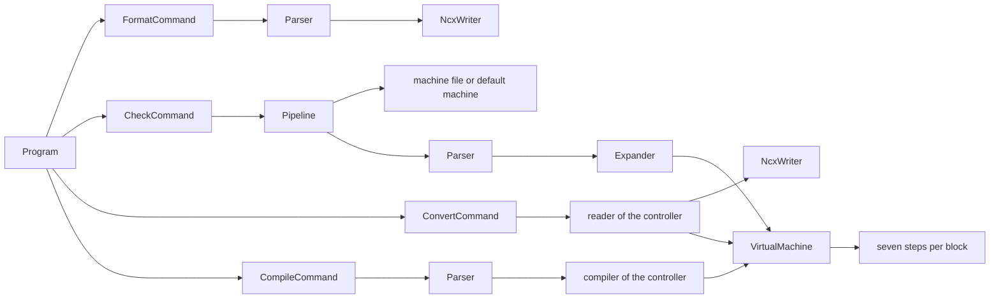

# Reading the code

Status: 2026-09-18, phase 3. The path through the code for the first afternoon (code-guidelines 10.3): from `src/Ncx.Cli/Program.cs`, where every command of `ncx` starts, through one `ncx format` run and one `ncx check` run into the virtual machine, then through one `ncx convert` of a source of the 2.5D example into NCX and one `ncx compile` of the example back to a controller, file by file (P3-07).

The C# needed is the C# of code-guidelines 10.2: classes, methods, `if`, `foreach`, `switch`, lists and dictionaries. Every rule in the code starts with a comment that names the section of the specification it implements, `(virtual machine 3.5)` or `(D90)`; open that section beside the code and read the two together (code-guidelines 1 and 2). The names of the sections are the names of the documents: language is `docs/spec/ncx-language.md`, virtual machine `docs/spec/ncx-virtual-machine.md`, machine-config `docs/spec/machine-config.md`, architecture `docs/architecture/architecture.md`, and D90 is a row of `docs/decisions/decisions.md`. Every path below is written from the root of the repository.

## 0. Build, run, test

```sh
dotnet build NCXchange.sln
dotnet run --project src/Ncx.Cli -- format docs/spec/examples/2.5D_FRAESEN.ncx
dotnet test NCXchange.sln
```

Everything after `--` is the command line of `ncx`; where this tour writes `ncx check ...`, run `dotnet run --project src/Ncx.Cli -- check ...` (phase 7 packs the tool as `ncx`). The map of the projects is `src/README.md`, with a table from a question, "where is the tool change?", to the file that answers it; every folder has a README of a few lines. What the tool does as a whole, and the three levels at which it is changed, is on the front page, `docs/README.md`.



## 1. The command line

`src/Ncx.Cli/Program.cs`. `Main` calls `Run(args, output, error)`, and `Run` builds the root command with its commands by hand: `FormatCommand`, `CheckCommand`, `TraceCommand`, `AnnotateCommand`, `ConvertCommand`, `AnalyzeCommand`, `CompileCommand` and `PluginCommand`, one class each in `src/Ncx.Cli/Commands/`. `Readers()` and `Compilers()` below it register one reader and one compiler per controller family, a line each (code-guidelines 5, Strategy and Registry). This is the composition root (code-guidelines 5): no container, no global setting, the wiring on the screen is all there is. `root.Parse(args)` reads the command line; a mistake in it is the diagnostic `CLI001` and exit code 2, before anything runs (D97). Otherwise `Invoke` calls the command that the first word names.

Two things every command shares:

- The diagnostics. `src/Ncx.Core/Model/Diagnostics.cs` collects them; every stage reports into one list and nothing the user can cause is an exception (code-guidelines 6). `ToText()` writes one line each, `file(line): ERROR VM042: message` (D98). A code is a constant: `CLI` in `src/Ncx.Cli/DiagnosticCodes.cs`, `PAR` and `VM` in the `DiagnosticCodes` files of `src/Ncx.Core/Model/`, and every `PAR` and `VM` code with its rule and severity in `docs/spec/generated/diagnostics.md`.
- The exit codes, `src/Ncx.Cli/ExitCodes.cs`: 0 without an ERROR; 1 with one, with a WARNING under `--strict`, or when `format --check` finds a difference; 2 when the run did not start (D97).

## 2. One `ncx format` run

```sh
dotnet run --project src/Ncx.Cli -- format docs/spec/examples/2.5D_FRAESEN.ncx
```

`format` reads an NCX file and writes it in canonical form. It is the parser and the canonical writer and nothing else: no machine file, no expander, no virtual machine (D91). The example is canonical already, so the output is the file itself, and with `--check` the command exits 0. A hand-written block in free order shows what the writer does:

```text
Y=2 LINE COMP=LEFT X=7 F=200 ; note
```

comes out as

```text
LINE X=7 Y=2 F=200 COMP=LEFT                            ; note
```

the verb first, the words in the order of the rank table, the comment in column 57 (language 5 rules 6 and 7; D90, D92).

### 2.1 The command

`src/Ncx.Cli/Commands/FormatCommand.cs`. `Create` declares the file argument and the options `--check`, `--output` and `--strict`, and hands their values to `Run`. `Run` is the whole command:

1. Read the file as UTF-8 text with `src/Ncx.Cli/InputFile.cs`; a file that cannot be read is `CLI002`, exit code 2.
2. `Parser.Parse(text, file, new ParserOptions())`: NCX text in, an `NcxProgram` out (2.2).
3. An ERROR of the parser stops here: the diagnostics go to the standard error, nothing is written, exit code 1.
4. `NcxWriter.Write(program)`: the canonical text (2.3).
5. Write it to the standard output or into the file of `--output`; under `--check` compare it with the file instead and name the first line that differs (`CLI003`, an INFO, exit code 1).

### 2.2 The parser

`src/Ncx.Core/Parsing/Parser.cs`. `Parse` reads the text line by line; one line is one block (language 3). Follow line 10 of the example:

```text
TOOL=1 OFFSET:LEN=1 OFFSET:RAD=1 RPM=1592               ; H5 TOOL CALL 1 Z S1592  |  F: N40 T1 M6, ...
```

1. `src/Ncx.Core/Parsing/Lexer.cs` cuts the text into lines (`SplitLines`) and reads one line (`LexLine`): the comment starts at the first `;` outside a string or an expression, the words are separated by spaces, and a line without a word is trivia, kept as it was read (language 3; D92). Line 10 has four words and a comment.
2. `src/Ncx.Core/Parsing/WordLexer.cs` reads one word, `KEY`, `KEY:ADDR`, `KEY=VALUE` or `KEY:ADDR=VALUE`, and tells the type of the value by its form: `1` an integer, `1.5` a decimal, `CW` an identifier, `"text"` a string, `{$Q1 + 20}` an expression (language 3). This is the file that parses a word: `OFFSET:LEN=1` gives the key `OFFSET`, the address `LEN` and the integer `1`.
3. Back in the parser, `BuildWords` looks every key up in the word catalog, `src/Ncx.Core/Catalog/WordCatalog.cs`, and turns the value into a record of the model; an expression goes to `src/Ncx.Core/Expressions/ExprParser.cs`. The catalog is a table, one file per table of language 4: `TOOL` and `OFFSET` are in `src/Ncx.Core/Catalog/ToolWords.cs`, `RPM` in `src/Ncx.Core/Catalog/SpindleWords.cs`. `CheckWords` checks each word against its entry with `src/Ncx.Core/Catalog/WordCheck.cs`: may it have an address, does it take this value.
4. `src/Ncx.Core/Parsing/BlockRules.cs` applies the block rules of language 5: at most one verb, axis words only under a verb that carries them, a key once per block, the partner words (`FRAME` needs a motion verb).
5. After the last line, `src/Ncx.Core/Parsing/StructurePass.cs` finds the file frame, `FILE=BEGIN NCX=1` to `FILE=END`, and the programs and subprograms as sections (language 4.1, 4.13).

The result is a record, `src/Ncx.Core/Model/NcxProgram.cs`: the blocks (`src/Ncx.Core/Model/Block.cs`), each with its words (`src/Ncx.Core/Model/Word.cs`) and its comment, the sections, the trivia and the diagnostics. It never changes afterwards; a stage that changes a program builds a new one (code-guidelines 7). A mistake is reported and the parser goes on, so that one run shows every mistake of a file. Save a copy of a small program with the block `TOOL=1 TOOL=2` and format it:

```text
$ dotnet run --project src/Ncx.Cli -- format twice.ncx
twice.ncx(4): ERROR PAR015: TOOL stands twice in the block; a key appears once per block, and only a different address makes a different word (language 5 rule 4).
```

### 2.3 The writer

`src/Ncx.Core/Writing/NcxWriter.cs`. `Write` goes through the blocks in file order and puts every trivia line back in front of the first block with a greater line number (D92). `WriteBlock` writes one block: `CanonicalOrder.Sort` (`src/Ncx.Core/Catalog/CanonicalOrder.cs`) sorts the words by their rank in `src/Ncx.Core/Catalog/CanonicalRanks.cs`, the rank table of D90; every word writes itself (`Word.ToCanonical`), a number exactly as it was read (language 2 rule 5); and the comment gets column 57. The rank comes from the catalog alone, never from a machine file, so the canonical text of a program never depends on the machine (D91, D93).

### 2.4 Where it is tested

- `tests/Ncx.Acceptance/Examples/ExampleFormatTests.cs`: the five examples format to themselves byte for byte, the acceptance test of phase 0.
- `tests/Ncx.Acceptance/Cli/FormatCommandTests.cs`: the command with its options and exit codes, the block in free order above among them.
- `tests/Ncx.Core.Tests/Parsing/BlockRulesTests.cs` and `tests/Ncx.Core.Tests/Writing/NcxWriterTests.cs`: one test per rule, named after it, `BlockRule1_TwoVerbs_IsError`. The test names read as the list of rules, and each test is a short NCX text with the expected result under it.

## 3. One `ncx check` run

```sh
dotnet run --project src/Ncx.Cli -- check docs/spec/examples/2.5D_FRAESEN.ncx
```

prints nothing and exits 0: the example has no mistake, and the output it is compared with in the tests, `tests/Ncx.Acceptance/Expected/2.5D_FRAESEN.check.txt`, is empty. To see what `check` reports, save these lines as mistake.ncx:

```text
FILE=BEGIN NCX=1
PROGRAM=BEGIN NAME="T"
UNITS=MM
PRELOAD=4
TOOL=5
LINE X=10
PROGRAM=END
FILE=END
```

and check it:

```text
$ dotnet run --project src/Ncx.Cli -- check mistake.ncx
mistake.ncx(5): WARNING VM042: Tool 4 was preloaded but tool 5 is called (virtual machine 3.5).
mistake.ncx(6): ERROR VM201: LINE moves at the active feed, and no F is set (virtual machine 3.1).
mistake.ncx(6): WARNING VM500: LINE cuts while spindle TOOL, the spindle of the current tool holder, is OFF (virtual machine 5).
```

The exit code is 1, because of the ERROR. The rest of this section follows the run to each of the three lines.

### 3.1 The command

`src/Ncx.Cli/Commands/CheckCommand.cs`. `check` shares its file argument and its options with `trace` and `annotate`: `src/Ncx.Cli/Commands/RunOptions.cs` declares `--machine`, `--strict`, `--skip-blocks` and `--expand-cycles` and reads them into the record `src/Ncx.Cli/RunSettings.cs`. `Run` has three lines: run the pipeline without a listener, write the diagnostics, return the exit code. The work is in the pipeline.

### 3.2 The pipeline

`src/Ncx.Cli/Pipeline.cs`. `Pipeline.Run` is the order of virtual machine 1 and architecture 10, one stage after the other:

1. Read the NCX file, and the machine file of `--machine` when there is one; a machine file that cannot be read is `CLI100`, exit code 2.
2. The machine. Without `--machine` it is the built-in default machine of D103, `src/Ncx.Config/DefaultMachine.cs`: one work spindle `MAIN` with its C axis, one tool holder with the tool spindle `TOOL`, the axes X Y Z A B C, the coolant channel `STANDARD`. With `--machine`, `src/Ncx.Config/MachineConfigLoader.cs` loads the TOML file into the records of `src/Ncx.Core/Machine/MachineConfig.cs`, and a machine file with an ERROR stops the run here.
3. Parse, with the same parser as `format`.
4. Expand. `src/Ncx.Core/Expander/Expander.cs` turns the expansion rules of the machine file into ordinary NCX blocks around the block that triggers them, a `HOME Z` before every tool change for example (machine-config 5a; D63). The default machine has no rules, so mistake.ncx comes back as it was.
5. Run the virtual machine STATIC: the options of the machine (`VmOptions.ForMachine`, `src/Ncx.Core/VirtualMachine/VmOptions.cs`) with those of the command line over them, `new VirtualMachine(machine, options, diagnostics)`, `vm.Run(expanded)`.
6. Collect the diagnostics in the order they were reported: the machine file's, then the parser's, the expander's and the virtual machine's (D98).

What a run gives back to its command, the diagnostics, the program and the exit code, is `src/Ncx.Cli/PipelineRun.cs`.

### 3.3 The run

`src/Ncx.Core/VirtualMachine/VirtualMachine.Static.cs`. The class `VirtualMachine` is written in several files, one per topic (a `partial class`); this one is the STATIC walk of virtual machine 1 and D99. `Run`:

1. A program with an ERROR of the parser never starts (virtual machine 2.9).
2. The pre-pass over the whole file, `CheckFile` of `src/Ncx.Core/VirtualMachine/Validation/RunValidation.cs`: labels and jump targets, and the rules about a block as it is written.
3. Every program of the file, each from the state of a channel at the start of a run: `WalkSection` executes its blocks from `PROGRAM=BEGIN` to `PROGRAM=END`, one `Execute(block)` each, and stops at the first ERROR. A `CALL` is followed into its subprogram once its block is done (`FollowCall`, `EnterSub`), `TIMES=n` in n passes.
4. Every subprogram that no program calls, once, from the default entry state of D99.

In mistake.ncx the ERROR of line 6 stops the walk after that block; `PROGRAM=END` never runs.

### 3.4 One block in seven steps

`src/Ncx.Core/VirtualMachine/VirtualMachine.cs`. `Execute(block)` is the numbered list of virtual machine 3 as code, one method per step, in the same order:

```text
1. ParseAndValidate       the block arrives parsed; a SKIP block is skipped under --skip-blocks (D53)
   ExecutePseudoWords     @SAVE and @RESTORE of the blocks the expander generated (3.10)
2. ResolveRolesAndAxes    which spindle, which holder, which axis each word means (3.8)
3. ApplyStateWords        every state word through its handler
4. ApplyFrameVerb         SHIFT, TILT, TILT_AXIS, SETPOS (3.4)
5. ExecuteMotion          RAPID, LINE, ARC, RETRACT, HOME, CYCLE_CALL (3.1 to 3.3)
   ApplyFlowWords         PROGRAM=BEGIN, PROGRAM=END, CALL (architecture 5.1)
6. ResetBlockScope        what lives for one block only
7. RaiseEvents            the events for the listeners (virtual machine 7)
```

`ExecutePseudoWords` is in `src/Ncx.Core/VirtualMachine/VirtualMachine.Restore.cs`; between steps 2 and 3 and after step 5 the validation looks at the block (`BeforeBlock` and `AfterBlock` of `RunValidation`). Follow line 10 of the example again, `TOOL=1 OFFSET:LEN=1 OFFSET:RAD=1 RPM=1592`:

- Step 2, `ResolveRolesAndAxes`. The words carry no role address, so each goes to the default resource of its kind (virtual machine 3.8 rule 2). `src/Ncx.Core/VirtualMachine/ResourceResolver.cs` answers: `TOOL` goes to the tool holder `H1` of the default machine, `RPM` to its tool spindle `S2`, and `OFFSET` to the holder of the `TOOL` of the same block. The answers are kept in `src/Ncx.Core/VirtualMachine/BlockContext.cs`, the one object the later steps read.
- Step 3, `ApplyStateWords`. `TOOL` first, then the other words, the cycle definition last. `src/Ncx.Core/VirtualMachine/WordHandlers.cs` is the table from a key to the method that applies the word (code-guidelines 5, table-driven dispatch). `TOOL` is handled in `src/Ncx.Core/VirtualMachine/Handlers/ToolHandlers.cs`, which calls `ApplyTool` of `src/Ncx.Core/VirtualMachine/ToolChangeRules.cs`, the tool change table of virtual machine 3.5; `RPM` in `src/Ncx.Core/VirtualMachine/Handlers/SpindleHandlers.cs`. The state they change is `src/Ncx.Core/VirtualMachine/State/ChannelState.cs`, one class per table of virtual machine 2: the holder `H1` is a `HolderState` (`src/Ncx.Core/VirtualMachine/State/HolderState.cs`), whose `SpindleTool` becomes tool 1.
- Steps 4 and 5 do nothing for this block, which has no verb. A frame verb goes to `src/Ncx.Core/VirtualMachine/FrameRules.cs`; `RAPID` and `LINE` go to `src/Ncx.Core/VirtualMachine/MotionRules.cs`; line 22, `ARC=CW X=2 Y=7 R=5`, goes to `src/Ncx.Core/VirtualMachine/ArcRules.cs`, which finds the working plane and the start, and on to `src/Ncx.Core/Geometry/ArcResolver.cs`, which resolves the arc from its radius (virtual machine 3.2).
- Step 7, `RaiseEvents`. Nobody listens during `check`, so nothing is raised; under `trace` this block raises `TOOL_BEGIN` and one `STATE_CHANGE` per variable it changed (section 4).

The three lines of mistake.ncx come from three places:

- `VM042`, line 5: `ApplyTool` in `ToolChangeRules` finds tool 4 preloaded and tool 5 called. The magazine has to cycle twice, which is a WARNING, and the run goes on.
- `VM201`, line 6: `MoveStraight` in `MotionRules`, step 5, finds a `LINE` and no feed. That is an ERROR.
- `VM500`, line 6: `AfterBlock` in `RunValidation` checks the rules of the validation list that read the state a block leaves, and `src/Ncx.Core/VirtualMachine/Validation/SpindleValidation.cs` finds the spindle OFF under a `LINE`. The validation list of virtual machine 5 is one file per family in `src/Ncx.Core/VirtualMachine/Validation/`, and each rule has its row in the table that `docs/spec/generated/diagnostics.md` is written from.

Each reports into the `Diagnostics` of the run with its code, `VM042` from `src/Ncx.Core/Model/DiagnosticCodes.Vm.cs`, `VM201` from `src/Ncx.Core/Model/DiagnosticCodes.Motion.cs`, `VM500` from `src/Ncx.Core/Model/DiagnosticCodes.Validation.cs`. The pipeline collects them, `CheckCommand` writes them, and `ExitCodes.OfRun` makes the ERROR exit code 1.

### 3.5 Where it is tested

- `tests/Ncx.Acceptance/Cli/CheckCommandTests.cs`: `check` on every example, the exit codes, `--strict`.
- `tests/Ncx.Acceptance/Examples/ExampleCheckTests.cs` with the files of `tests/Ncx.Acceptance/Expected/`: what each example reports, compared as a whole file.
- `tests/Ncx.Core.Tests/VirtualMachine/ToolChangeTests.cs`: one test per row of the tool change table, `ToolN_ThePreloadedTool_ConsumesThePreload`; `tests/Ncx.Core.Tests/VirtualMachine/VmHarness.cs` is how a test executes blocks one by one and looks at the state.
- `tests/Ncx.Core.Tests/VirtualMachine/Validation/`: one test per rule of the validation list.

One class of tests runs on its own:

```sh
dotnet test tests/Ncx.Core.Tests --filter FullyQualifiedName~ToolChangeTests
```

## 4. The same run with a listener

```sh
dotnet run --project src/Ncx.Cli -- trace docs/spec/examples/2.5D_FRAESEN.ncx
```

```text
channel  block  variable          old      new
1        5      UNITS                      MM
1        6      ORIGIN            0        1
1        10     TOOL:H1           0        1
1        10     OFFSET:LEN:H1     0        1
1        10     OFFSET:RAD:H1     0        1
1        10     RPM:S2            0        1592
```

`src/Ncx.Cli/Commands/TraceCommand.cs` runs the same pipeline with one listener, `src/Ncx.Cli/History/TraceListener.cs`. A listener implements `IVmListener` (`src/Ncx.Core/VirtualMachine/Events/IVmListener.cs`), one method, `On(VmEvent)`, and receives every event with `Before` and `After`, two snapshots of the channel state that it can read and never change (virtual machine 7; D61). The events of one block are put together in `src/Ncx.Core/VirtualMachine/Events/BlockEvents.cs`, in the order the block acts; `src/Ncx.Core/VirtualMachine/VirtualMachine.Events.cs` keeps the listeners and hands the `After` of one block on as the `Before` of the next. The whole event sequence of the example is `tests/Ncx.Acceptance/Expected/2.5D_FRAESEN.events.txt`. `ncx annotate`, `src/Ncx.Cli/Commands/AnnotateCommand.cs`, is the same run with another listener; the analytics of phase 4 and the plugins that watch a run are listeners as well.

## 5. One `ncx convert` run

```sh
dotnet run --project src/Ncx.Cli -- convert docs/spec/examples/sources/2.5D_FRAESEN.fanuc.nc --machine fanuc-mill-30i
```

`convert` reads a controller program into NCX (architecture 7). The Fanuc source of the example, `O0001` with its `N` blocks, comes out as the blocks of the example, except the few its notes give the Fanuc reading otherwise: the offsets where `G43 H` and `D` stand (note 2, D7), the speed with its `M3`, `HOME Z` for `G91 G28 Z0` (note 4), and no `SECTION` for a comment line (D92, D217). Follow the source block

```text
N80 G43 Z2. H1
```

which comes out as

```text
RAPID Z=2 OFFSET:LEN=1
```

### 5.1 The command

`src/Ncx.Cli/Commands/ConvertCommand.cs`. `Run`:

1. Read the program with `src/Ncx.Cli/ControllerProgram.cs`: UTF-8 text, or Windows-1252 with the WARNING `CLI352` when its bytes are no UTF-8 (D229).
2. The machine of the run through `src/Ncx.Cli/RunMachine.cs`, as `check` finds it, but never the built-in default machine: without `--machine` and without an ncx.toml that names a machine the run stops with `CLI250`, exit code 2, since only the machine file tells what its M codes mean (D77).
3. The controller of the machine file, `controller = "fanuc"` in `machines/fanuc-mill-30i.toml`, chooses the reader from the registry that `Program.Readers()` fills.
4. `Convert`: the reader, then the expander and the virtual machine STATIC over the program the reader produced, whose diagnostics follow the reader's, so that `convert` reports what `check` would (architecture 7, 10).
5. `NcxWriter.Write`, the writer of `format`, to the standard output or into the file of `--output`.

With `--batch <folder> --report <file>` instead of the program, `src/Ncx.Cli/Commands/BatchCommand.cs` runs the same `Convert` over every file of a folder, never stops on an error, and writes a summary of counts and codes, which is how a reader is run over the corpus of the maintainer (`tests/corpus-reports/README.md`).

### 5.2 The reader

`src/Ncx.Readers/ReaderBase.cs`. `Read` is the skeleton every reader shares, a template method (code-guidelines 5); a family fills in the steps its controller writes otherwise.

1. The tokenizer of the family, `src/Ncx.Readers/Fanuc/FanucTokenizer.cs`, cuts the text into `SourceBlock`s of `SourceWord`s: `N80`, `G43`, `Z2.`, `H1`, and the comment `( )` of a block (controllers fanuc.md 1).
2. `StructureOf` says what each block is for the file: `%` the frame of the file, `O0001` the start of a program, `M2` its end. `src/Ncx.Readers/StructurePass.cs` lays out the plan of the reading from it: `FILE=BEGIN`, `PROGRAM=BEGIN NAME="2.5D FRAESEN" NUMBER=1`, the blocks, `PROGRAM=END`, `FILE=END` (language 4.13).
3. Every block of the plan updates `src/Ncx.Readers/SourceState.cs`, the small source-side state of what the controller leaves implicit: the modal groups (the `G0` of `N70` still moves `N80`), absolute or incremental, the preloaded tool (architecture 7).
4. `ReadBlock` of the family, `src/Ncx.Readers/Fanuc/FanucReader.cs`, hands the block to one file per concern in turn: `FanucMacro`, `FanucFrames`, `FanucToolWords`, `FanucCycles`, `FanucMotion`, `FanucBuilder`. For `N80` the length offset `G43 H1` is `OFFSET:LEN=1` in `src/Ncx.Readers/Fanuc/FanucToolWords.cs`, where the source has it (D7), and `Z2.` under the active `G0` is `RAPID Z=2` in `src/Ncx.Readers/Fanuc/FanucMotion.cs`, the verb written on every block (controllers fanuc.md 9).
5. A word that no concern reads keeps its block as `RAW:FANUC` with the WARNING `RDR001` (`src/Ncx.Readers/RawEmitter.cs`, D5): nothing is dropped, and the block goes back to the same controller verbatim.
6. The words go into `src/Ncx.Core/Writing/NcxBuilder.cs`, which puts them into canonical order at the end of the block; the program it builds is the record `NcxProgram` that `format` writes.

### 5.3 Where it is tested

- `tests/Ncx.Readers.Tests/Fanuc/`: one test per row of the Fanuc column of controller-mapping, NC text in and NCX text out, `G43H1_IsTheLengthOffset_AndG49Cancels` among them.
- `tests/Ncx.Acceptance/RoundTrips.cs`: every example source converted through the command line and compared with the example or with its frozen reading in `tests/Ncx.Acceptance/Expected/`, the differences its notes list named with their rules.
- `tests/Ncx.Acceptance/Cli/BatchCommandTests.cs`: the batch, and its reports of the example sources in `tests/corpus-reports/`.

## 6. One `ncx compile` run

```sh
dotnet run --project src/Ncx.Cli -- compile docs/spec/examples/2.5D_FRAESEN.ncx --machine heidenhain-itnc530
```

`compile` writes the program of an NCX file for one machine (architecture 8): here the Klartext program named after the example, 2.5D FRAESEN.h in the folder out/heidenhain-itnc530 of the working directory (machine-config 10). Follow line 10 of the example,

```text
TOOL=1 OFFSET:LEN=1 OFFSET:RAD=1 RPM=1592
```

which comes out as the tool call of the source:

```text
4 TOOL CALL 1 Z S1592
```

### 6.1 The command

`src/Ncx.Cli/Commands/CompileCommand.cs`. `Run` finds the machine as `convert` does, never the default machine (D77), the compiler of its controller from `Program.Compilers()`, and the tool table next to the machine file (D10); it parses the file with the parser of `format`, hands the program to the compiler, and writes the files the compiler gives into the folder, none after an ERROR, since that file goes to a control (D205).

### 6.2 The compiler

`src/Ncx.Compilers/CompilerBase.cs`. `Compile` is the template method of every compiler, four steps:

1. Expand, as `check` does: the expansion rules of the machine become NCX blocks, which the compiler writes like the others (virtual machine 1, D63).
2. `RAW` of another controller and a native cycle of another family are an ERROR before anything is written (`src/Ncx.Compilers/CompilerBase.Native.cs`; D5, D94).
3. The virtual machine runs STATIC with `src/Ncx.Compilers/StepRecorder.cs` subscribed, which keeps every block with its state before and after it. The compiler writes from those states, never deciding what a word means itself (architecture 8), and looks ahead in them for the `{next}` tool of a preload (D52).
4. `WriteSteps` (`src/Ncx.Compilers/CompilerBase.Walks.cs`) hands every block to `WriteBlock` of the family, each subprogram once (D99), and lays out the files by `program_layout` (D48).

`WriteBlock` of `src/Ncx.Compilers/Heidenhain/HeidenhainCompiler.cs` writes a block concern by concern in the order the control executes it: the frame, the tool, the modes and functions, each state word in a Klartext block of its own before the motion (language 5 rule 3), then the motion, then the dwell, the calls and the end. For line 10, `src/Ncx.Compilers/Heidenhain/HeidenhainToolCall.cs` assembles `TOOL CALL 1 Z S1592` from `TOOL`, the `WORKPLANE=XY` of the header and the `RPM` of the same block; the two offsets are implicit in the call (controllers heidenhain.md 8 rule 3). What stays the same for every family is in the folder above it: `src/Ncx.Compilers/TargetState.cs` knows what the control has active, so that a modal word stands only where it changes (`F2387` once); `src/Ncx.Compilers/NumberFormatter.cs` writes every number by the `[format]` of the machine, `X+50,4` with the comma and without trailing zeros; `src/Ncx.Compilers/OutputBuffer.cs` numbers the blocks and ends the lines as the `[format]` says, from 0 and with CR LF on the iTNC 530.

With `--machine fanuc-mill-30i` the same run goes through `src/Ncx.Compilers/Fanuc/FanucCompiler.cs` and gives the Fanuc source back, `N40 T1 M6`, `N60 S1592 M3`, `N80 G43 Z2. H1`.

### 6.3 Where it is tested

- `tests/Ncx.Compilers.Tests/Heidenhain/`: one test per rule of heidenhain.md 8, `Rule3_ToolCall_IsAssembledFromToolWorkplaneAndTheRpmOfTheSameBlock` among them; `tests/Ncx.Compilers.Tests/Fanuc/` the same for fanuc.md 10.
- `tests/Ncx.Acceptance/RoundTrips.cs`: every source converted and compiled back to its own controller, and the example and the frozen readings compiled to the other one, each compared with the source under the comparison rules of code-guidelines 8, which `tests/Ncx.Acceptance/NcComparer.cs` implements: block numbers, comments and number formats do not count, the order of the words in a motion block does, and a difference is shown as a unified diff. A difference the documents cannot settle is an `NcException` that names its question.

## 7. Where a change goes

Before a change goes into the source, the two levels above it are checked (code-guidelines 10.1; `docs/README.md`, Three levels of extension):

| Level | For | Where |
|---|---|---|
| Configuration | another machine, other M codes, a retract before the tool change, a cycle | a TOML file in `machines/` or `cycles/`, after `docs/spec/machine-config.md`; `src/Ncx.Config/MachineConfigLoader.cs` reads it, and no code changes |
| Plugin | a rule the TOML cannot say | one class with one method: an `IProgramRewriter` (`src/Ncx.Core/Expander/IProgramRewriter.cs`) changes blocks before the run, an `IVmListener` watches it, an `ISourceRule` reads a source block for a reader, an `IBlockWriter` changes the lines of a compiler. `ncx plugin new` copies the template of `templates/ncx-plugin/`, whose coolant clutch rule is the one of code-guidelines 11; `docs/plugins.md` tells the rest |
| Source | a new word, a new rule of the virtual machine, a new controller family, a new command | below |

In the source:

- A new word of the language is its entry in the catalog file of its table in `src/Ncx.Core/Catalog/`, its rank in `src/Ncx.Core/Catalog/CanonicalRanks.cs`, and, when it sets state, one registration line and one method in the class of its group in `src/Ncx.Core/VirtualMachine/Handlers/`. `tests/Ncx.Core.Tests/Catalog/WordCatalogTableTests.cs` then rewrites `docs/spec/generated/word-catalog.md`, so the change shows in the diff next to the specification.
- A new rule of the validation list goes into the file of its family in `src/Ncx.Core/VirtualMachine/Validation/`, with its code in `src/Ncx.Core/Model/`, its row in the table and a test named after it.
- A source construct a reader does not read yet goes into the file of its concern in the folder of the family, `src/Ncx.Readers/Fanuc/FanucCycles.cs` for a Fanuc cycle, with a test in `tests/Ncx.Readers.Tests/`; its written form into the concern of the compiler, `src/Ncx.Compilers/Heidenhain/HeidenhainCycles.cs` for a Klartext cycle. A new controller family is a folder of each and one registration line in `Program.Readers()` and `Program.Compilers()`.
- A new command is a class in `src/Ncx.Cli/Commands/`, one line in `Program.Run`, and its row in the command table of architecture 10.
- A change of the language, the virtual machine or the configuration is a decision first (`docs/README.md`, Conventions).

## 8. What comes next

`ncx analyze` runs the program INTERPRETED with the analytics of `src/Ncx.Analytics/` subscribed as listeners (phase 4), the Siemens reader and compiler follow the two families of this tour (phase 5), jobs run several channels at once (phase 6), and plugins load into the runs of every command (phase 7). Each folder has its README, and the tests of each are named after the rules they check.

## About this tour

For whoever changes it: a file or folder of the repository is written in backticks with its path from the repository root, and a class or method by its name alone (`ToolChangeRules`, `Execute`); a command line that names files of the repository stands in a block marked `sh`; program text, output and a file the reader writes himself stand in a block marked `text` and name no file. `tests/Ncx.Acceptance/Repository/ReadingTheCodeTests.cs` checks that every path named that way exists and that the route runs from `src/Ncx.Cli/Program.cs` through `format` and `check` into `src/Ncx.Core/VirtualMachine/VirtualMachine.cs`, then through `convert` into `src/Ncx.Readers/ReaderBase.cs` and through `compile` into `src/Ncx.Compilers/CompilerBase.cs`. A task that renames or moves a file the tour names updates the tour in the same commit (code-guidelines 12).
